# Fluxogramas — UI e navegação (Well Paid Android)

Este documento descreve os **fluxos de ecrã** da app Android nativa desde o arranque até às áreas autenticadas, com **diagramas Mermaid**. A implementação vive em [`WellPaidNavHost.kt`](../android-native/app/src/main/java/com/wellpaid/navigation/WellPaidNavHost.kt), [`NavRoutes.kt`](../android-native/app/src/main/java/com/wellpaid/navigation/NavRoutes.kt) e [`MainShellScreen.kt`](../android-native/app/src/main/java/com/wellpaid/ui/main/MainShellScreen.kt).

**Legenda geral:** setas indicam navegação `navigate` ou `popBackStack`; rotas entre aspas são valores de `NavRoutes`.

---

## 1. Arranque (cold start) e decisão de rota inicial

O `SessionViewModel` lê tokens; enquanto `startRoute == null` mostra-se apenas um indicador de progresso.

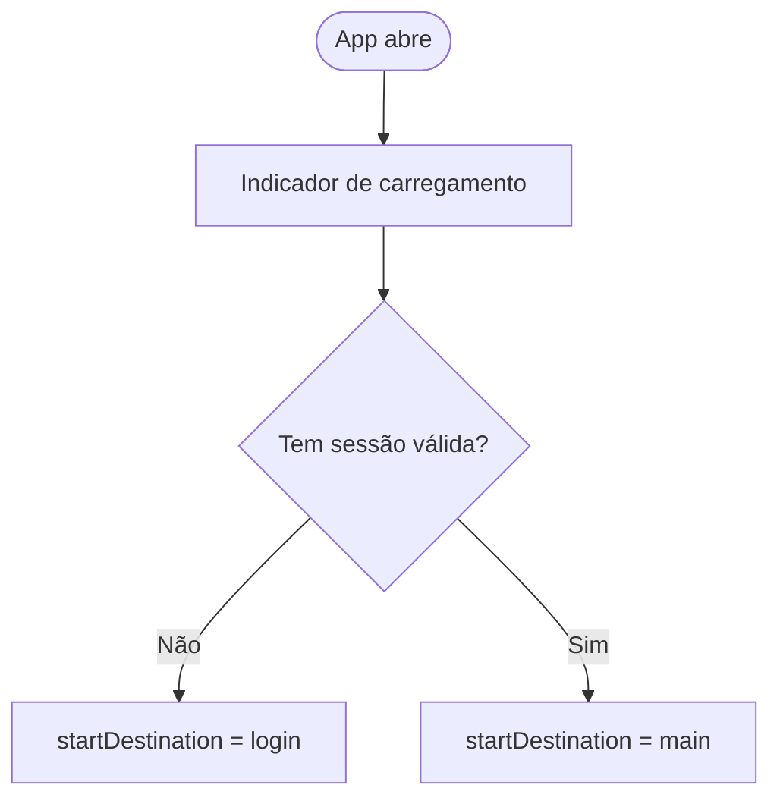

---

## 2. Fluxo de autenticação (rotas públicas)

Nestas rotas o **bloqueio por app lock** não se aplica (`isPublicAuthRoute`).

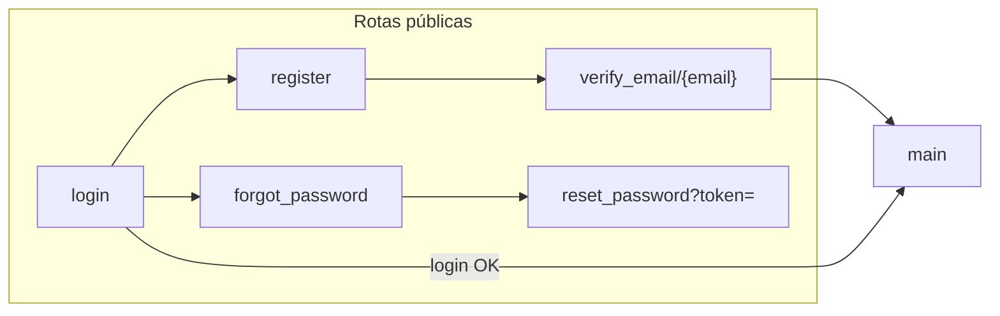

**Comportamentos importantes**

- **Login com sucesso:** `navigate(main)` com `popUpTo(login) inclusive` — apaga a pilha até ao login.
- **Registo → verificação:** navega para `verify_email` e remove `register` da pilha.
- **Reset password:** pode voltar ao `login` ou só dar `pop`.

---

## 3. Mapa global: Main como hub

Após autenticação, o **Main** é o centro: tabs, atalhos e navegação para formulários e ecrãs satélite.

```mermaid
flowchart TB
  main["main / MainShellScreen"]
  settings["settings"]
  expNew["expense_new"]
  expId["expense/{id}"]
  inst["installment_plan/{groupId}"]
  incNew["income_new"]
  incId["income/{id}"]
  gNew["goal_new"]
  gDet["goal/{id}"]
  gEdit["goal_edit/{id}"]
  shopL["shopping_lists"]
  shopNew["shopping_list_new"]
  shopId["shopping_list/{listId}"]
  ann["announcements"]
  rec["receivables"]
  inv["investments"]
  emNew["emergency_reserve_new"]
  main --> settings
  main --> expNew
  main --> expId
  main --> inst
  main --> incNew
  main --> incId
  main --> gNew
  main --> gDet
  main --> gEdit
  main --> shopL
  main --> shopNew
  main --> shopId
  main --> ann
  main --> rec
  main --> inv
  main --> emNew
  settings --> display["display_name"]
  settings --> family["family"]
  settings --> security["security"]
  settings --> cats["manage_categories"]
```

**Logout** (desde Settings): `navigate(login)` com `popUpTo(main) inclusive`.

---

## 4. Shell principal (Main): tabs e atalhos

Resumo funcional (detalhe em `MainShellScreen`):

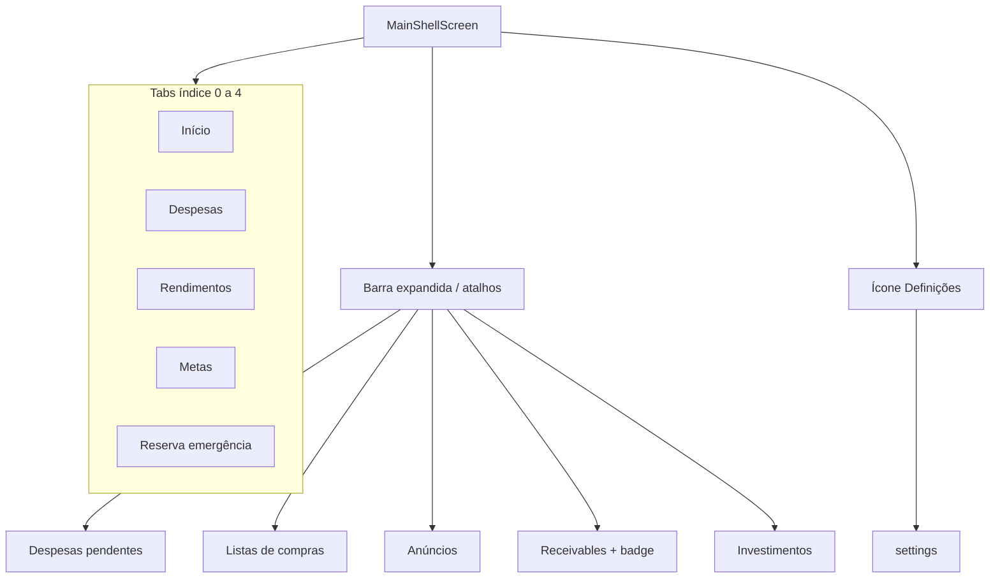

- **Gestos:** swipe entre tabs 1–4 e regresso ao Início; ao voltar das listas de compras pode seleccionar-se o tab 0 via `MAIN_SHELL_SELECT_TAB` no `savedStateHandle` do `main`.

---

## 5. Despesas e plano de prestações

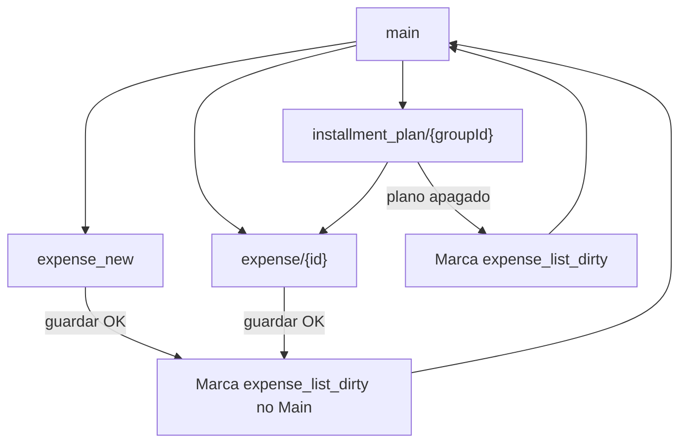

---

## 6. Rendimentos

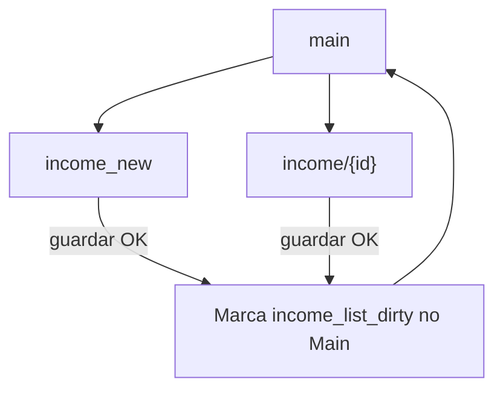

---

## 7. Metas: detalhe, edição e eliminação

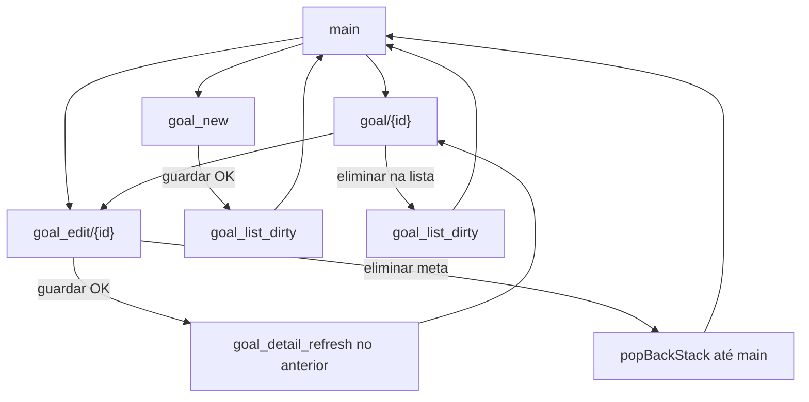

A eliminação no **editar** usa `popBackStack(Main, inclusive=false)` para evitar ecrã branco quando a pilha é curta.

### 7.1 Reserva: novo plano (ecrã dedicado)

A partir do tab **Reserva** (`EmergencyReserveContent`), o botão **Adicionar reserva** navega para `emergency_reserve_new` com o mesmo `EmergencyReserveViewModel` ancorado no back stack do **Main** (partilhado com o tab). O formulário está em `EmergencyReservePlanFormScreen`. Após **criar plano** com sucesso, marca-se `emergency_reserve_dirty` no `Main` e faz-se `popBackStack` para voltar ao shell; a lista de planos actualiza no tab.

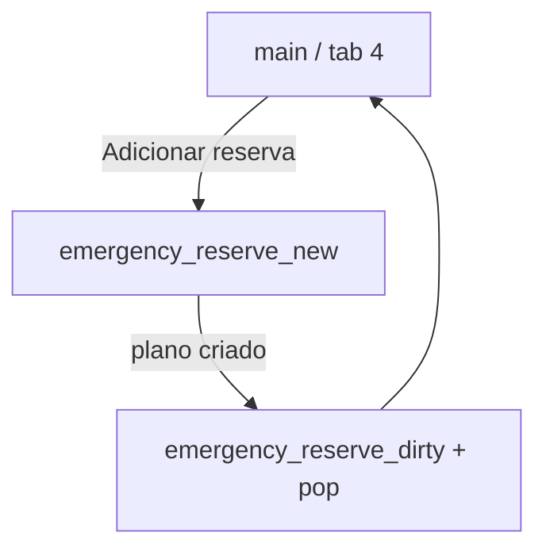

---

## 8. Listas de compras

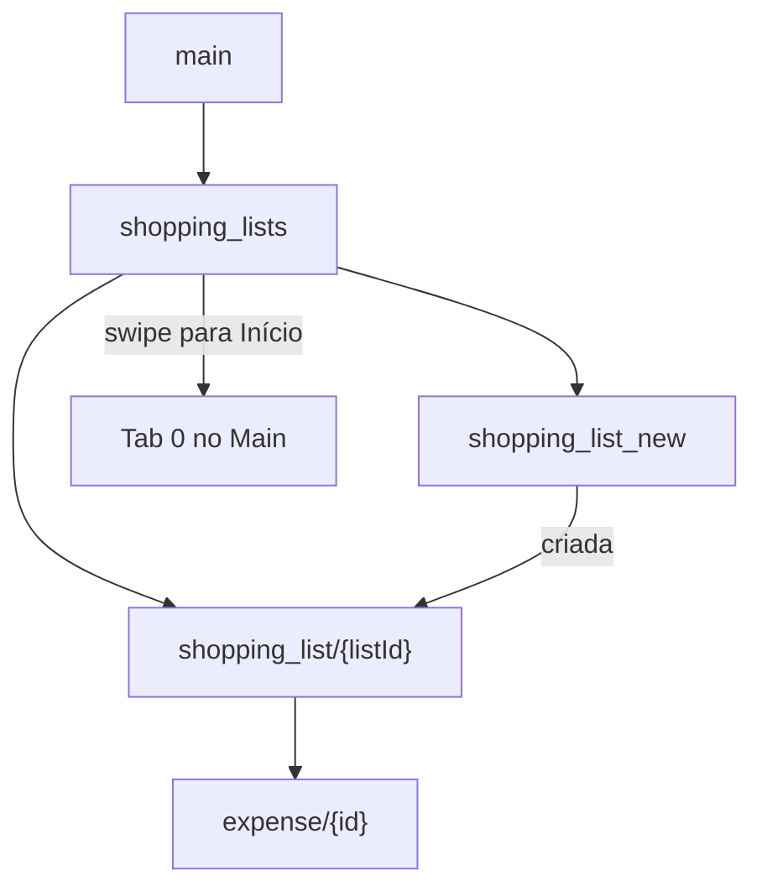

---

## 9. Anúncios e receivables

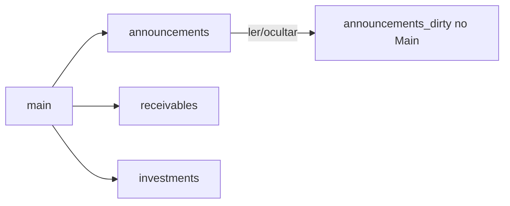

---

## 10. Definições (árvore)

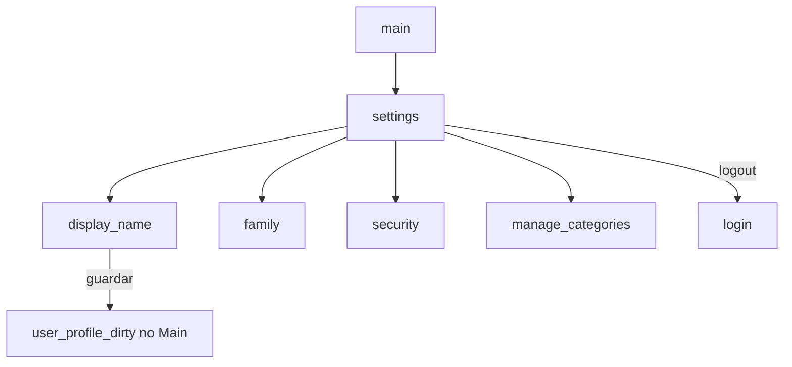

---

## 11. Bloqueio da app (App Lock)

Quando `locked` é verdadeiro e a rota **não** é pública, sobrepõe-se o `AppLockScreen` a todo o `NavHost`.

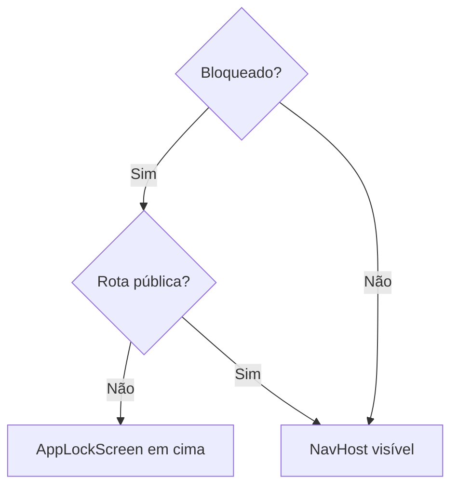

Rotas públicas: `login`, `register`, `forgot_password`, prefixos `verify_email`, `reset_password`.

---

## 12. Resumo: chaves `savedStateHandle` no Main

| Chave | Quando é escrita |
|--------|-------------------|
| `expense_list_dirty` | Após criar/editar despesa; apagar plano de prestações |
| `income_list_dirty` | Após criar/editar rendimento |
| `goal_list_dirty` | Metas: criar, eliminar no detalhe, eliminar no editar (após pop até Main) |
| `goal_detail_refresh` | Após guardar no editar meta |
| `announcements_dirty` | Interacção em anúncios |
| `emergency_reserve_dirty` | Após criar plano de reserva no ecrã `emergency_reserve_new` |
| `user_profile_dirty` | Nome a apresentar (e similares) |
| `MAIN_SHELL_SELECT_TAB` | Ex.: voltar das listas de compras para o tab Início |

---

## 13. Onde aprofundar

| Tema | Ficheiro |
|------|----------|
| Lista exacta de rotas | [`NavRoutes.kt`](../android-native/app/src/main/java/com/wellpaid/navigation/NavRoutes.kt) |
| Composables e callbacks | [`WellPaidNavHost.kt`](../android-native/app/src/main/java/com/wellpaid/navigation/WellPaidNavHost.kt) |
| Tabs, prefetch, atalhos | [`MainShellScreen.kt`](../android-native/app/src/main/java/com/wellpaid/ui/main/MainShellScreen.kt) |
| Sessão / rota inicial | [`SessionViewModel.kt`](../android-native/app/src/main/java/com/wellpaid/ui/session/SessionViewModel.kt) |

Para o **mapa API ↔ ecrã**, ver [ANDROID_API_BACKEND_CONTRACT.md](./ANDROID_API_BACKEND_CONTRACT.md). Para leitura única com o plano mestre, ver [WELL_PAID_DOCUMENTACAO_UNIFICADA.md](./WELL_PAID_DOCUMENTACAO_UNIFICADA.md).
