# Well Paid — documentação unificada

Documento único no repositório que agrega o **plano mestre**, os **planos temáticos** exportados do Cursor (perfil local), e os ficheiros de **contrato API**, **checklist QA** e **índice da raiz**.

- **Consolidado em:** 2026-05-03
- **Originais Cursor:** `%USERPROFILE%\.cursor\plans\*.plan.md` (não versionados no Git; sincronizar manualmente quando alterar planos no IDE).
- **Ficheiros modulares em** [`docs/`](./): mantêm-se como fontes editáveis; este ficheiro é uma **agregação**.

---

## Índice

1. [Parte I — Plano mestre do sistema Well Paid](#parte-i--plano-mestre-do-sistema-well-paid)
2. [Parte II — Planos temáticos (origem Cursor)](#parte-ii--planos-temáticos-origem-cursor)
3. [Parte III — Contrato API, QA E2E e índice da raiz](#parte-iii--contrato-api-qa-e2e-e-índice-da-raiz)
4. [Manutenção deste documento](#manutenção-deste-documento)

---

# Parte I — Plano mestre do sistema Well Paid

Este plano serve como **mapa único** para onboarding, QA, auditoria ou para **recriar** o comportamento do produto. Baseia-se no código em [`android-native`](../android-native) e na API **FastAPI** em [`backend/`](../backend/) (contrato JSON alinhado com [`core/network`](../android-native/core/network)); [`app.py`](../app.py) na raiz é a stack **Flask** legacy (web). Planos antigos dispersos devem ser considerados **substituídos** por este, salvo detalhe específico que queiras copiar para uma secção "Histórico".

---

## 1. Arquitetura em camadas

| Camada | Local | Função |
|--------|--------|--------|
| App UI | [`android-native/app`](../android-native/app) | Compose, ecrãs, ViewModels Hilt, tema Well Paid |
| Modelos | [`android-native/core/model`](../android-native/core/model) | DTOs kotlinx.serialization alinhados à API |
| Rede | [`android-native/core/network`](../android-native/core/network) | Retrofit, APIs por domínio |
| Armazenamento | [`android-native/core/datastore`](../android-native/core/datastore) | Tokens encriptados; preferências UI podem viver em [`UiPreferencesRepository`](../android-native/app/src/main/java/com/wellpaid/data/UiPreferencesRepository.kt) (DataStore no módulo app) |
| API mobile (FastAPI) | [`backend/`](../backend/) | REST JSON consumida pelo APK: [`backend/app/main.py`](../backend/app/main.py), JWT, Alembic/PostgreSQL, deploy típico Vercel. |
| Legacy (Flask) | [`app.py`](../app.py) | Aplicação web monolítica; rotas HTML e fluxos antigos; **não** substitui o contrato principal do cliente Android moderno. |

**Build Android:** `API_BASE_URL` via [`app/build.gradle.kts`](../android-native/app/build.gradle.kts); release com R8 + ProGuard em [`proguard-rules.pro`](../android-native/app/proguard-rules.pro); módulo opcional [`baselineprofile`](../android-native/baselineprofile) para perfis baseline.

**Versão visível no APK (diretriz prioritária):** no **login** e em **Definições → Sobre**, a linha segue o composable [`WellPaidLoveVersionLine`](../android-native/app/src/main/java/com/wellpaid/ui/version/WellPaidLoveVersionLine.kt) (atualização contínua no ecrã):

**`SIGLA:1.x(AAA)(dd/MM/yyyy)(D.H.M.S.mmmm)`**

| Bloco | Significado |
|--------|------------|
| **SIGLA** | `BuildConfig.VERSION_SIGLA` ← `wellpaid.version.sigla` em [`android-native/gradle.properties`](../android-native/gradle.properties) (defeito **`AN_CA_RBCCA`**). |
| **1.x** | **x** = `versionCode` (`derivedVersionCode` = `alembicHead − 1` a partir do maior `NNN_*.py` em [`backend/alembic/versions`](../backend/alembic/versions)). Ex.: head **042** → `1.41`. |
| **(AAA)** | Código Alembic de três dígitos: `BuildConfig.REVISION_CODE` (igual ao head, salvo override `wellpaid.revision.code` em `gradle.properties`). |
| **(dd/MM/yyyy)** | **Data de hoje** (fuso `America/Sao_Paulo`, alinhada à âncora abaixo). |
| **(D.H.M.S.mmmm)** | **Apenas números**, separados por ponto: dias, horas, minutos, segundos, milissegundos (milis com **4 dígitos**). Contagem de **tempo decorrido** desde a **âncora fixa** `10/02/2023 02:39` (America/São Paulo) — ver [`DaughterTogetherClock`](../android-native/app/src/main/java/com/wellpaid/ui/version/DaughterTogetherClock.kt). O relógio no ecrã actualiza a cada milissegundo. |

**Exemplo de leitura:** `AN_CA_RBCCA:1.41(042)(03/05/2026)(1247.14.33.12.0008)` — build 1.41, Alembic 042, hoje 03/05/2026, e desde a âncora passaram 1247 dias, 14 h, 33 m, 12 s, 0008 ms (nomes dos períodos **não** aparecem na UI).

**Nota:** alterar só esta lógica ou `gradle.properties` **não** exige nova migração Alembic; schema novo exige `NNN_*.py`. A actualização em tempo real tem custo de CPU ligeiro; ajustar o `delay` em `WellPaidLoveVersionLine` se for necessário reduzir frequência.

---

## 2. Arranque da app (cold start)

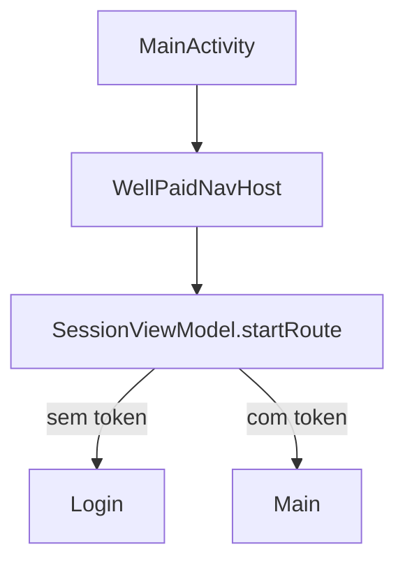

- [`MainActivity.kt`](../android-native/app/src/main/java/com/wellpaid/MainActivity.kt): tema, `WellPaidNavHost`, `FLAG_SECURE`, telemetria de abertura.
- [`SessionViewModel`](../android-native/app/src/main/java/com/wellpaid/ui/session/SessionViewModel.kt): `startRoute` = `NavRoutes.Login` ou `NavRoutes.Main` conforme [`TokenStorage`](../android-native/core/datastore).
- Enquanto `startRoute == null`, mostra-se um `CircularProgressIndicator` ([`WellPaidNavHost.kt`](../android-native/app/src/main/java/com/wellpaid/navigation/WellPaidNavHost.kt)).

---

## 3. Grafo de navegação (rotas)

Definições em [`NavRoutes.kt`](../android-native/app/src/main/java/com/wellpaid/navigation/NavRoutes.kt), composables em [`WellPaidNavHost.kt`](../android-native/app/src/main/java/com/wellpaid/navigation/WellPaidNavHost.kt).

| Rota | Ecrã / propósito |
|------|------------------|
| `login` | Login, registo esquecido |
| `register` | Registo |
| `verify_email/{email}` | Verificação de email |
| `forgot_password` | Recuperar password |
| `reset_password?token=` | Nova password com token |
| `main` | **Shell principal** (tabs) |
| `expense_new`, `expense/{id}` | Nova / editar despesa |
| `installment_plan/{groupId}` | Plano de prestações |
| `income_new`, `income/{id}` | Novo / editar rendimento |
| `goal_new`, `goal/{id}`, `goal_edit/{id}` | Metas: novo, detalhe, editar |
| `shopping_lists`, `shopping_list_new`, `shopping_list/{listId}` | Listas de compras |
| `announcements` | Anúncios |
| `receivables` | Valores a receber/pagar |
| `settings` | Definições |
| `display_name`, `family`, `security`, `manage_categories` | Sub-rotas das definições |

**Padrões de navegação importantes**

- Após guardar formulários, `popBackStack` + `savedStateHandle` no `Main` com chaves `*_dirty` (ex.: `goal_list_dirty`, `expense_list_dirty`, `income_list_dirty`, `announcements_dirty`, `user_profile_dirty`) para refrescar listas no shell.
- Eliminação de meta no editar: `popBackStack(NavRoutes.Main, inclusive = false)` em [`popGoalEditAfterDelete`](../android-native/app/src/main/java/com/wellpaid/navigation/WellPaidNavHost.kt) — evita tela branca quando a pilha é só `Main → GoalEdit`.

---

## 4. Shell principal (`main`): tabs e atalhos

[`MainShellScreen.kt`](../android-native/app/src/main/java/com/wellpaid/ui/main/MainShellScreen.kt)

- **5 tabs (0–4):** Início, Despesas, Rendimentos, Metas, Reserva de emergência.
- **Prefetch:** ViewModels escopados ao `mainRouteEntry` (Home, Expenses, Incomes, Goals, Emergency, ShoppingLists) com delays em [`MainPrefetchTiming`](../android-native/app/src/main/java/com/wellpaid/data/MainPrefetchTiming.kt).
- **Gestos:** swipe entre tabs 1–4 e voltar ao home; `MAIN_SHELL_SELECT_TAB` no `savedStateHandle` para saltar para um tab (ex.: voltar das listas de compras para o home).
- **Barra inferior expandida:** atalhos (ex.: despesas pendentes), listas de compras, recados, **receivables** (com badge [`MainReceivablesBadgeViewModel`](../android-native/app/src/main/java/com/wellpaid/ui/main/MainReceivablesBadgeViewModel.kt)).
- **Definições:** ícone/abertura via `onOpenSettings` → rota `settings`.

Conteúdos por tab (ficheiros típicos): [`HomeDashboardContent.kt`](../android-native/app/src/main/java/com/wellpaid/ui/home/HomeDashboardContent.kt), `ExpensesListContent`, `IncomesListContent`, `GoalsListContent`, `EmergencyReserveContent`.

---

## 5. Fluxo "Login → Main → Settings" (exemplo pedido)

1. **Login** [`LoginScreen`](../android-native/app/src/main/java/com/wellpaid/ui/login): credenciais → tokens guardados → `goMain` limpa back stack até `login` e navega para `main`.
2. **Main:** tabs + atalhos; primeiro carregamento depende dos ViewModels e da API.
3. **Settings** [`SettingsScreen`](../android-native/app/src/main/java/com/wellpaid/ui/settings/SettingsScreen.kt): nome a apresentar, família, segurança (biometric/quick login), categorias, logout (volta a `login` com `popUpTo(main)` inclusive).
4. Sub-ecrãs: `DisplayName`, `Family`, `Security`, `ManageCategories` — cada um `popBackStack` ou notifica `user_profile_dirty` quando relevante.

---

## 6. Segurança e privacidade (transversal)

- **App lock / biometria:** [`AppSecurityManager`](../android-native/app/src/main/java/com/wellpaid/security), [`AppLockScreen`](../android-native/app/src/main/java/com/wellpaid/ui/security/AppLockScreen.kt); `showAppLock` quando `locked` e rota não é "pública" (`isPublicAuthRoute` em `WellPaidNavHost`).
- **Ocultar valores:** `CompositionLocalProvider(LocalPrivacyHideBalance)` ligado a preferências de privacidade.
- **Sessão:** logout limpa tokens e navega para login.

---

## 7. Domínios funcionais (resumo)

- **Despesas / prestações:** listas, formulário, plano de prestações; API via módulo network.
- **Rendimentos:** análogo às despesas.
- **Metas:** lista com progresso e miniatura se [`referenceThumbnailUrl`](../android-native/core/model/src/main/java/com/wellpaid/core/model/goal/GoalDtos.kt); formulário com pesquisa de preços (toggle DataStore); detalhe e contribuições.
- **Listas de compras:** listas, detalhe, itens, sugestões de preço (debounce API), toggles de pesquisa automática, fluxo "adicionar produto" sem fechar o sheet após guardar (comportamento atual).
- **Recados:** `AnnouncementsScreen`.
- **Receivables:** ecrã dedicado + badge no shell.
- **Reserva de emergência:** tab dedicada.
- **Telemetria:** [`TelemetryReporter`](../android-native/app/src/main/java/com/wellpaid/telemetry) no arranque.

---

## 8. Backend (alinhamento com o APK)

- O APK usa **REST JSON** nos paths definidos em [`core/network`](../android-native/core/network) (origem `BuildConfig.API_BASE_URL`, sem path extra — ver `android-native/app/build.gradle.kts`).
- A implementação canónica é **FastAPI** em [`backend/app/main.py`](../backend/app/main.py); OpenAPI em `GET /docs` e `GET /openapi.json` no mesmo host.
- Para "recriar o sistema": PostgreSQL, variáveis de ambiente, migrações Alembic em [`backend/alembic`](../backend/alembic), deploy da API (ex. Vercel), e coerência com os DTOs Android ([`ANDROID_API_BACKEND_CONTRACT.md`](./ANDROID_API_BACKEND_CONTRACT.md)).
- [`app.py`](../app.py) (Flask) na raiz mantém páginas HTML legacy; não confundir com o contrato mobile documentado acima.

---

## 9. O que já foi consolidado nas entregas recentes (para não perder)

- Performance release: R8, shrink, ProGuard, baseline profile module.
- UX: bottom sheets Material3 `confirmValueChange` corrigido; lista de compras / metas com toggles de pesquisa automática (DataStore); feedback e textos (adicionar produto, placeholders).
- Navegação: delete meta sem segundo `pop` incorreto; scroll após escolher sugestão de preço.
- Lista de metas: miniatura quando há URL de referência.

---

## 10. Checklist para "recriar" o sistema (ordem sugerida)

1. **Infra:** PostgreSQL (ou DB do projeto), variáveis de ambiente, **deploy da API FastAPI** (`backend/`, ex. Vercel).
2. **Migrações / schema** alinhados com modelos usados pela API mobile.
3. **Android:** `wellpaid.api.release.url` / `local.properties` para debug; keystore release; `assembleRelease`.
4. **Fluxo manual E2E:** login → cada tab → criar/editar entidade representativa → settings → logout.
5. **Opcional:** gerar baseline profile com dispositivo/emulador; testes de regressão nas rotas críticas de navegação.

---

## 11. Limitações deste documento

- Não substitui **OpenAPI** (`/docs`) nem leitura linha a linha do código; para novas features, cruzar sempre DTO + endpoint real ([`ANDROID_API_BACKEND_CONTRACT.md`](./ANDROID_API_BACKEND_CONTRACT.md)).
- Rotas HTML legacy em [`app.py`](../app.py) podem não ser usadas pelo APK; o plano móvel centra-se no que [`WellPaidNavHost`](../android-native/app/src/main/java/com/wellpaid/navigation/WellPaidNavHost.kt) e `core/network` consomem.

---

# Parte II — Planos temáticos (origem Cursor)

Os blocos seguintes copiam o conteúdo dos ficheiros `*.plan.md` do perfil Cursor (ordenados alfabeticamente pelo campo `name`), **sem** o frontmatter YAML. Caminhos e referências internas aos planos podem apontar para outros clones ou versões antigas do repo; validar sempre contra o código actual.

---
## Admin console escopo

*Fonte Cursor:* `admin_console_escopo_56660c70.plan.md`

# Plano: Console de administração web (escopo e arquitetura)

## O que a aplicação é hoje (síntese)

- **Cliente principal:** app Android nativo ([`android-native/`](android-native/)), UI Material 3 com paleta documentada em [`android-native/app/src/main/java/com/wellpaid/ui/theme/Color.kt`](android-native/app/src/main/java/com/wellpaid/ui/theme/Color.kt) (navy `#1B2C41`, gold `#C9A94E`, cream `#F5F1E8`, etc.).
- **Backend:** FastAPI + PostgreSQL + SQLAlchemy ([`backend/`](backend/)), JWT (`Authorization: Bearer`) e refresh tokens em [`backend/app/api/routes/auth.py`](backend/app/api/routes/auth.py).
- **Modelo de utilizador** ([`backend/app/models/user.py`](backend/app/models/user.py)): `email`, `hashed_password`, `full_name`/`display_name`, `phone`, **`is_active`**, **`email_verified_at`**, `created_at`/`updated_at` ([`TimestampMixin`](backend/app/models/base.py)).
- **Dependência de API** ([`backend/app/api/deps.py`](backend/app/api/deps.py)): utilizadores sem e-mail verificado recebem 403 nas rotas normais — o admin terá de ser tratado à parte (ver abaixo).
- **Não existe** hoje: papel `admin`, rotas `/admin`, nem tabela/eventos para “tempo de uso” ou sessões analíticas. Os `refresh_tokens` não têm `created_at` ([`001_initial_schema.py`](backend/alembic/versions/001_initial_schema.py)), logo **não há como inferir “última atividade” só com o schema atual**.

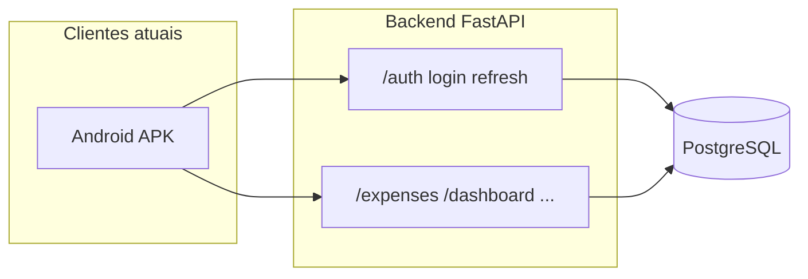

---

## Objetivo do produto

Um **painel web** (correr **localmente** no seu PC) para:

- Ver e gerir **contas** (utilizadores reais da app): e-mail, estado ativo, confirmação de e-mail, datas relevantes.
- Evoluir para **métricas de uso** (tempo / atividade) com dados que ainda precisam de ser definidos e recolhidos no backend.
- **Mesma identidade visual** que o app (cores e sensação “Well Paid” a partir de `Color.kt`).
- **Login com e-mail e palavra-passe** no **mesmo estilo** que o sistema (chamada a `POST /auth/login` e tokens JWT), mas **restringido a contas de administrador** — não basta “qualquer utilizador com login válido”.

---

## Decisões de desenho (recomendadas)

| Tema | Recomendação |
|------|----------------|
| **Quem pode entrar no console** | Coluna booleana no `users`, ex.: `is_admin` (default `false`), migrada com Alembic. Apenas estes utilizadores obtêm acesso às rotas `/admin/*`. |
| **JWT** | Incluir claim explícita (ex. `"role": "admin"` ou `"admin": true`) em tokens emitidos **só** para utilizadores admin **ou** validar sempre `user.is_admin` na dependência — evita confiar só no `sub`. |
| **E-mail não verificado** | A dependência atual bloqueia `email_verified_at is None`. Para admins, usar **`get_current_admin_user`** que exige `is_admin` e **não** aplica o 403 de “confirme o e-mail” (ou obrigar verificação também para admins — decisão de política; para operação interna, costuma permitir-se admin sem o mesmo gate que o app). |
| **Frontend** | SPA **Vite + React + TypeScript** (leve, adequado a “local”) ou Next.js se quiserem rotas/server components — para consumir só a API existente, **Vite é suficiente**. Pasta sugerida na raiz: `admin-console/` (sem misturar com `android-native/`). |
| **CORS** | Garantir que [`backend` CORS](backend/app/main.py) inclui a origem local do painel (ex. `http://localhost:5173`) via [`backend` settings / env](backend/app/core/config.py). |

---

## Escopo por fases

### Fase 1 — MVP do console (dados já na BD)

**Backend**

- Migração: `users.is_admin` (ou nome equivalente).
- Rotas sob prefixo `/admin`, protegidas por dependência admin, por exemplo:
  - `GET /admin/users` — lista paginada, filtros (email, `is_active`, verificado).
  - `GET /admin/users/{id}` — detalhe (opcional no MVP).
  - `PATCH /admin/users/{id}` — pelo menos **ativar/desativar** `is_active` (ação típica de gestão).
- Registo de router em [`backend/app/main.py`](backend/app/main.py).
- **Bootstrap do primeiro admin:** documentar um fluxo seguro (ex.: variável `ADMIN_BOOTSTRAP_EMAIL` só em dev, ou `INSERT`/`UPDATE` manual em produção uma vez) — **sem** hardcodar passwords no repositório.

**Frontend (local)**

- Ecrã de **login** (email/password) chamando o mesmo contrato que o app: [`LoginRequest`](backend/app/schemas/auth.py) / `TokenPairResponse`.
- Após login, se o token não for de admin (claim ou `GET /admin/me`), mostrar erro e não entrar no painel.
- **Dashboard / tabela:** colunas como e-mail, nome, `is_active`, `email_verified_at`, `created_at` (e `updated_at` como proxy fraco de “última alteração de perfil”, **não** tempo de uso real).
- Estilo: variáveis CSS alinhadas a `WellPaidNavy`, `WellPaidGold`, `WellPaidCream` de [`Color.kt`](android-native/app/src/main/java/com/wellpaid/ui/theme/Color.kt).

**Fora do escopo MVP:** métricas de tempo de uso precisas.

---

### Fase 2 — “Tempo de uso” e atividade (requer novo desenho)

Hoje **não há** dado de “quanto tempo a app esteve aberta” no servidor. Opções (da mais simples à mais rica):

1. **`last_seen_at` em `users`**, atualizado por:
   - heartbeat periódico desde o Android, ou
   - atualização em eventos já existentes (ex.: refresh de token, se instrumentarem o fluxo de refresh no servidor).
2. **Tabela de eventos** (`app_usage_events`: `user_id`, `event_type`, `occurred_at`) para agregações (DAU, sessões).
3. **Migração em `refresh_tokens`:** adicionar `created_at` e usar “último refresh” como proxy de sessão (ainda não é tempo de ecrã, mas é sinal de utilização).

O painel mostraria então: última atividade, possivelmente gráficos simples, export CSV, etc.

---

### Fase 3 — Melhorias opcionais

- Auditoria (quem admin desativou uma conta).
- Segundo factor / IP allowlist para `/admin` em produção (se no futuro o painel deixar de ser só local).
- Métricas agregadas (totais de utilizadores ativos, novos registos por semana).

---

## APK vs backend vs deploy — o que mexe e em que ordem

### Resposta direta

| Área | Fase 1 (MVP console) | Fase 2 (métricas de uso / tempo) |
|------|----------------------|----------------------------------|
| **APK (Android)** | **Não é obrigatório mexer.** O painel fala só com a API; o utilizador continua a usar a app como hoje. | **Provável mexer no APK** se quiserem “tempo de uso” ou “última atividade” fiáveis (ex.: heartbeat, ou eventos ao abrir a app). Se a métrica for só “último refresh de token” instrumentado no **servidor**, o APK pode continuar igual. |
| **Backend** | **Sim — é obrigatório:** migração (`is_admin`), rotas `/admin`, dependência de admin, eventual ajuste de JWT e CORS. | **Sim:** novas colunas/tabelas e lógica de escrita/leitura conforme o desenho escolhido. |
| **Console web** | **Novo projeto** (ex. `admin-console/`), corre **local** (`npm run dev`). Não substitui nem altera o APK. | Novas páginas/gráficos no mesmo painel. |
| **Redeploy (API em produção)** | **Sim, quando quiserem estas capacidades na API que já está no ar** (ex. Vercel): cada alteração ao código do `backend/` que vá para produção implica **novo deploy** da API. A base de dados em produção precisa da **migração Alembic** aplicada após (ou em conjunto com) o deploy que já contém o código compatível. | Idem: novo deploy sempre que o backend mudar; migrações adicionais. |
| **Novo deploy do APK** | **Não** — para o MVP do admin não há razão para publicar outra versão na Play Store. | **Só se** implementarem recolha de dados no cliente (ou mudarem chamadas à API). |

### Ordem recomendada dos passos (Fase 1)

1. **Backend em ambiente local:** implementar modelo + migração Alembic (`is_admin`), `get_current_admin_user`, rotas `/admin/*`, emissão de token com distinção admin (conforme desenho), e testes manuais com Uvicorn + Postgres local.
2. **Base de dados:** correr `alembic upgrade head` na BD que usam para desenvolvimento.
3. **Primeiro utilizador admin:** promover um `users` existente com `UPDATE ... SET is_admin = true` (ou fluxo documentado de bootstrap) — **nunca** commitar passwords nem URLs com credenciais.
4. **CORS:** no `.env` local do backend, incluir a origem do painel (ex. `http://localhost:5173`) em `CORS_ORIGINS` (ou o nome exacto da variável em [`backend/app/core/config.py`](backend/app/core/config.py)). Sem isto, o browser bloqueia o login do SPA.
5. **Console web:** criar o projeto Vite, ecrã de login (`POST /auth/login`), chamadas a `/admin/me` e listagens, tokens guardados em memória/sessionStorage conforme política escolhida.
6. **Produção (quando quiserem o admin a falar com a API já deployada):**
   - Fazer **merge/deploy** do `backend/` atualizado (Vercel ou o vosso pipeline).
   - Na **BD de produção**, correr a **mesma migração** Alembic (com `DATABASE_URL` de produção, a partir de máquina segura ou job de CI).
   - No painel Vercel (ou equivalente), atualizar **variáveis de ambiente** se necessário (ex. `CORS_ORIGINS` a incluir `http://localhost:5173` se o admin local chamar a API de produção — avaliar risco; alternativa é apontar o admin só para API local durante desenvolvimento).
7. **APK:** nenhum passo obrigatório nesta fase.

### Notas sobre “refazer deploy”

- **API:** cada alteração ao código Python do backend que queiram em produção = **novo deploy** dessa API.
- **PostgreSQL:** deploy da API **não** aplica migrações automaticamente por si só; convém ter um processo explícito (script, CI, ou comando documentado) para `alembic upgrade` na BD certa.
- **Painel admin local:** não precisa de “deploy” no sentido Vercel — corre na vossa máquina. Se no futuro hospedarem o admin na web, aí sim haveria deploy desse frontend.
- **APK na Play Store:** só volta a ser tema quando houver mudanças na app ou na Fase 2 com código nativo.

---

## Riscos e cuidados

- **Segurança:** rotas admin são alvo privilegiado — rate limit, validação de input, e nunca expor lista de utilizadores sem autenticação admin forte.
- **Separar mentalmente:** “gestão de contas da app” (utilizadores finais) vs “quem pode abrir o console” (admins) — ambos podem usar a mesma tabela `users` com `is_admin`, mas com regras diferentes nas dependências.

---

## Resumo executivo

| Capacidade | Fase 1 | Fase 2+ |
|------------|--------|--------|
| Lista de contas, e-mail, ativo, verificado, datas | Sim (dados existentes) | Refinar filtros/export |
| Mesmo login email/senha que o sistema | Sim (com flag admin + rotas dedicadas) | — |
| Cara visual alinhada ao app | Sim (tokens de `Color.kt`) | — |
| Tempo de uso real da aplicação | Não (não existe no backend) | Sim (instrumentação + BD) |

Este documento fixa o **escopo do projeto**; a implementação concreta segue na ordem: **migração + API admin + SPA local**, depois **métricas de uso** conforme prioridade de negócio.


---

## Admin console passos compassados

*Fonte Cursor:* `admin_console_passos_compassados_043ec41c.plan.md`

# Plano: evolução passo a passo do Admin Console

## Princípios de execução

- Entrega em **micro-passos** (uma tarefa por vez), com validação técnica após cada passo.
- Cada passo termina com um bloco fixo: **"O que precisas fazer agora"** contendo:
  - se precisa **redeploy backend**
  - se precisa **redeploy admin console**
  - se precisa **novo APK**
  - comandos diretos (quando aplicável)
- Priorizar recursos de maior valor com baixo custo operacional (Vercel/Neon free).

## Ordem de implementação (próximas fases)

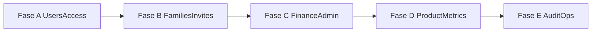

## Fase A — Gestão de utilizadores e acessos (primeiro alvo)

### A1. Melhorar listagem e filtros de contas

- Backend: estender `GET /admin/users` com filtros por `is_active`, `is_admin`, `email_verified`, intervalo de `created_at`, e ordenação.
- Frontend: barra de filtros no admin com paginação preservada.
- Arquivos principais:
  - [`backend/app/api/routes/admin.py`](backend/app/api/routes/admin.py)
  - [`backend/app/schemas/admin.py`](backend/app/schemas/admin.py)
  - [`admin-console/src/api.ts`](admin-console/src/api.ts)
  - [`admin-console/src/App.tsx`](admin-console/src/App.tsx)

### A2. Ações admin adicionais por utilizador

- Adicionar ação de **promover/rebaixar admin** com proteção anti-autobloqueio.
- Adicionar ação de **revogar sessões** (invalidar `refresh_tokens` ativos do utilizador).
- Frontend: botões de ação com confirmação explícita.
- Arquivos principais:
  - [`backend/app/api/routes/admin.py`](backend/app/api/routes/admin.py)
  - [`backend/app/models/refresh_token.py`](backend/app/models/refresh_token.py)
  - [`admin-console/src/api.ts`](admin-console/src/api.ts)
  - [`admin-console/src/App.tsx`](admin-console/src/App.tsx)

### A3. Detalhe de conta (painel lateral/modal)

- Mostrar dados de perfil + métricas rápidas de atividade (`last_seen_at`, eventos 30d).
- Reaproveitar endpoint existente de summary e adicionar endpoint de detalhe se necessário.

## Fase B — Famílias e convites

- Criar vista administrativa de famílias e convites (pendente/aceite/expirado).
- Ações de suporte: cancelar convite e remover membro com guarda de segurança.
- Arquivos alvo:
  - [`backend/app/api/routes/families.py`](backend/app/api/routes/families.py)
  - novo submódulo admin se necessário em [`backend/app/api/routes/admin.py`](backend/app/api/routes/admin.py)
  - telas no [`admin-console/src/App.tsx`](admin-console/src/App.tsx) (ou extração para componentes)

## Fase C — Finance admin (cobertura do core)

- CRUD admin para categorias (despesa/receita) e consistência mínima de dados.
- Relatório de saúde de dados (órfãos, inconsistências comuns).

## Fase D — Métricas de produto (baixo custo)

- Funil simples: cadastro -> verificação -> login -> ativo 7/30d.
- Contadores agregados, sem explosão de eventos.

## Fase E — Auditoria e operação

- Log de ações administrativas (quem fez o quê e quando).
- Visão de erros agregados e utilitários de manutenção segura.

## Contrato de finalização por passo

Ao concluir cada passo, devolver sempre:

- **Resultado entregue** (o que entrou)
- **Validação executada** (testes/build/lint)
- **O que precisas fazer agora**:
  - Redeploy backend: Sim/Não
  - Redeploy admin console: Sim/Não
  - Novo APK: Sim/Não
  - Comandos exatos (se houver)

## Critérios de custo/segurança

- Evitar novos writes de alta frequência.
- Favorecer agregações e deduplicação por dia quando houver telemetria.
- Confirmar ações destrutivas no UI admin.


---

## APK performance e travamentos

*Fonte Cursor:* `apk_performance_e_travamentos_1da547c7.plan.md`

# Plano: travamentos, tela branca e performance do APK (Android)

## Contexto no código atual

- **Lista de compras — adicionar item**: o fluxo principal está em [`ShoppingListDetailScreen.kt`](d:/Projects/Well Paid/android-native/app/src/main/java/com/wellpaid/ui/shopping/ShoppingListDetailScreen.kt) (`AddEditItemBottomSheet`), com sugestões de preço via API debouncada no [`ShoppingListDetailViewModel.kt`](d:/Projects/Well Paid/android-native/app/src/main/java/com/wellpaid/ui/shopping/ShoppingListDetailViewModel.kt) (`onShoppingItemLabelForPriceHints`, delay 280 ms, até 12 resultados).
- **Metas — formulário**: [`GoalFormScreen.kt`](d:/Projects/Well Paid/android-native/app/src/main/java/com/wellpaid/ui/goals/GoalFormScreen.kt) + [`GoalFormViewModel.kt`](d:/Projects/Well Paid/android-native/app/src/main/java/com/wellpaid/ui/goals/GoalFormViewModel.kt) (pesquisa de produtos, `GoalProductSearchResultsSheet` com `LazyColumn` e [`ProductPriceHitCard`](d:/Projects/Well Paid/android-native/app/src/main/java/com/wellpaid/ui/components/ProductPriceHitCard.kt) com `AsyncImage` para miniaturas).
- **Build release**: em [`app/build.gradle.kts`](d:/Projects/Well Paid/android-native/app/build.gradle.kts) está `isMinifyEnabled = false` — o APK release não usa R8/shrink; não há ficheiros **Baseline Profile** no projeto (oportunidade clara vs. apps que seguem o guia oficial de performance).

## Achado crítico: `ModalBottomSheet` e `confirmValueChange`

Em vários sítios o estado do sheet usa:

```kotlin
confirmValueChange = { new -> new != SheetValue.Hidden }
```

Isto aparece em **adicionar/editar item**, **concluir compra**, **resultados de pesquisa de metas** e [`WellPaidDatePickerField.kt`](d:/Projects/Well Paid/android-native/app/src/main/java/com/wellpaid/ui/components/WellPaidDatePickerField.kt).

No Material 3, quando `confirmValueChange` devolve **false**, a mudança de estado é **cancelada**. Para `new == SheetValue.Hidden`, a expressão `new != Hidden` é **false** — ou seja, **a transição para o estado fechado é rejeitada**. Na prática, o gesto de arrastar para fechar pode **não concluir** (folha “rebenta” de volta); o utilizador pode interpretar como **travamento** ou **ecrã que não responde**, mesmo com o botão fechar a funcionar (porque remove o composable e não depende dessa transição).

**Plano de ação:** rever a intenção (provavelmente era bloquear fecho durante `isSaving`). O padrão habitual é `confirmValueChange = { !isSaving }` ou equivalente, **permitindo** `Hidden` quando não há gravação. Validar em dispositivo após alteração.

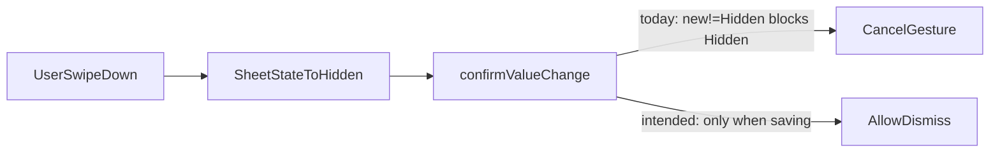

## “Tela branca” — hipóteses alinhadas ao código

1. **Ecrã de carregamento sem conteúdo aparente**: em modo edição, `GoalFormScreen` mostra só um `CircularProgressIndicator` enquanto `isLoading` ([`GoalFormScreen.kt`](d:/Projects/Well Paid/android-native/app/src/main/java/com/wellpaid/ui/goals/GoalFormScreen.kt)); o fundo pode parecer “vazio” se o utilizador esperar o mesmo layout do tema principal.
2. **Ramo vazio no `when` do detalhe da lista**: em [`ShoppingListDetailScreen.kt`](d:/Projects/Well Paid/android-native/app/src/main/java/com/wellpaid/ui/shopping/ShoppingListDetailScreen.kt) existe `detail == null -> { }` sem UI — só é problemático se alguma combinação de estado deixar `detail == null`, `isLoading == false` e `errorMessage == null` (ex.: regressão futura ou corrida); vale **instrumentar** e garantir fallback (mensagem ou retry).
3. **Exceção não tratada na UI** (menos provável sem crash): se ocorrer, o Compose pode deixar a área em branco — por isso a fase de diagnóstico com **Logcat** e builds com assert é importante.

## Performance geral do APK (o que outros projetos costumam fazer)

| Área | Prática comum | Situação no projeto / nota |
|------|----------------|----------------------------|
| **Medição** | Android Studio Profiler (CPU, memória, jank), **Macrobenchmark** para cenários (abrir ecrã, scroll, abrir sheet) | Definir 2–3 fluxos: abrir “nova meta”, abrir bottom sheet item, pesquisar preços |
| **Arranque e jank** | **Baseline Profiles** (AGP + `baseline-prof.txt` gerado com Macrobenchmark) | Não existe ainda; impacto típico em cold/warm start e caminhos quentes Compose |
| **Tamanho e runtime** | **R8** com `minifyEnabled` + `shrinkResources` (após testes com regras Retrofit/Hilt/Serialization) | Release com `isMinifyEnabled = false` ([`app/build.gradle.kts`](d:/Projects/Well Paid/android-native/app/build.gradle.kts)) |
| **Compose** | `remember` / `derivedStateOf`, keys estáveis em listas, evitar recomposição em cada tecla quando possível | Lista de sugestões: `Column` + `forEach` no bottom sheet de compras — para muitas recomposições, considerar `LazyColumn` + keys |
| **Imagens** | Coil com tamanho máximo, `crossfade` moderado, cache | [`ProductPriceHitCard`](d:/Projects/Well Paid/android-native/app/src/main/java/com/wellpaid/ui/components/ProductPriceHitCard.kt) carrega URLs externas em listas |
| **Rede pós-login** | Espaçar prefetch (já existe [`MainPrefetchTiming.kt`](d:/Projects/Well Paid/android-native/app/src/main/java/com/wellpaid/data/MainPrefetchTiming.kt)) | Ajustar com base em métricas reais após profiling |
| **Produção** | Play Vitals (ANR, taxa de frames), opcionalmente Firebase Performance / Sentry ANR | Para priorizar o que os utilizadores veem em campo |

## Ordem de trabalho sugerida

1. **Reprodução e evidência**: gravar um vídeo + capturar **Logcat** no momento do “branco”/travamento; se for release, verificar **Play Console** (ANR, “User-perceived crashes”). Confirmar se o gesto de fechar o bottom sheet falha (valida a hipótese do `confirmValueChange`).
2. **Correção UX do bottom sheet**: alterar `confirmValueChange` para só bloquear quando `isSaving` (ou remover se não for necessário); aplicar de forma consistente nos três `ModalBottomSheet` em lista de compras, `GoalProductSearchResultsSheet` e avaliar `WellPaidDatePickerField`.
3. **Hardering de UI**: fallback explícito quando `detail == null` sem loading/erro; opcionalmente esqueleto (shimmer) em `GoalFormScreen` em vez de spinner isolado, para não parecer “tela branca”.
4. **Performance Compose/listas**: na folha de item de compras, trocar lista de sugestões para `LazyColumn` com `key` estável se o profiling mostrar frame drops ao digitar; rever limites de imagem Coil nas listas de preços.
5. **Build release**: planear ativação gradual de **R8** + regras já preparadas em [`proguard-rules.pro`](d:/Projects/Well Paid/android-native/app/proguard-rules.pro); adicionar módulo **Baseline Profile** e gerar perfil para rotas principais (main shell, goals, shopping).
6. **Regressão**: testes Macrobenchmark locais (CI opcional) para `frameDuration` e startup antes/depois.

## Ficheiros centrais para tocar (após confirmação)

- [`ShoppingListDetailScreen.kt`](d:/Projects/Well Paid/android-native/app/src/main/java/com/wellpaid/ui/shopping/ShoppingListDetailScreen.kt) — `AddEditItemBottomSheet`, `CompletePurchaseSheet`, ramo `detail == null`.
- [`GoalFormScreen.kt`](d:/Projects/Well Paid/android-native/app/src/main/java/com/wellpaid/ui/goals/GoalFormScreen.kt) — `GoalProductSearchResultsSheet`, estado de loading inicial.
- [`WellPaidDatePickerField.kt`](d:/Projects/Well Paid/android-native/app/src/main/java/com/wellpaid/ui/components/WellPaidDatePickerField.kt) — mesmo padrão de sheet.
- [`app/build.gradle.kts`](d:/Projects/Well Paid/android-native/app/build.gradle.kts) — Baseline Profile plugin, minify quando estiver validado.


---

## Auditoria partilha despesas

*Fonte Cursor:* `auditoria_partilha_despesas_3b28cce6.plan.md`

# Auditoria: partilha familiar (valor / %, PT-BR, contraparte calculada)

## O que está bem coberto

- **Fluxo principal:** [`ExpenseFormViewModel.kt`](android-native/app/src/main/java/com/wellpaid/ui/expenses/ExpenseFormViewModel.kt) separa modo montante (`split_mode` `amount`) e percentagem (`percent`), recalcula a parte do outro em R$ quando o total ou a parte do dono mudam, e envia `ownerPercentBps` / `peerPercentBps` coerentes com o backend ([`expense_splits.py`](backend/app/services/expense_splits.py)).
- **Validação no guardar:** montante — `ownerCents` em `[0, total]`; percentagem — parsing para bps e soma implícita 10000 via `peer = 10000 - owner`.
- **Edição MVP:** [`splitTextsForEdit`](android-native/app/src/main/java/com/wellpaid/ui/expenses/ExpenseFormViewModel.kt) com `ExpenseDto.splitMode == "percent"` preenche % derivada de `my_share_cents` / `amount_cents` (aceite de arredondamento).
- **UI:** interruptor após “Partilhar com”, teclado monetário alinhado ao montante para a parte do dono, contraparte só leitura ([`ExpenseFormScreen.kt`](android-native/app/src/main/java/com/wellpaid/ui/expenses/ExpenseFormScreen.kt)).

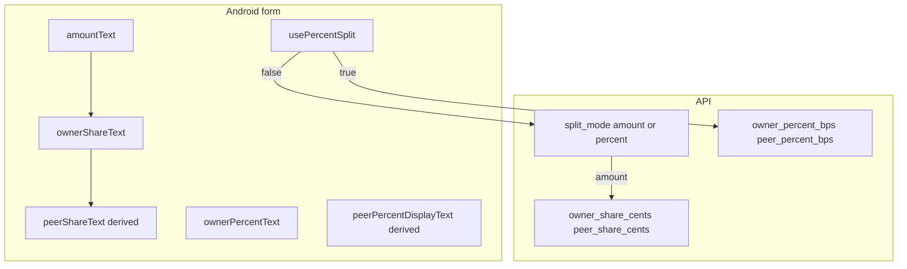

---

## Lacunas e inconsistências

### 1. Comentário vs comportamento: `sharedWithUserId`

Em [`ExpenseFormUiState`](android-native/app/src/main/java/com/wellpaid/ui/expenses/ExpenseFormViewModel.kt) o comentário indica que `null` significa “partilha com toda a família”. O **guardar** exige membro escolhido (`expense_share_pick_member`), e o backend em [`create_expense`](backend/app/api/routes/expenses.py) rejeita `is_shared` sem peer (`Indica o membro...`). **O comentário está desatualizado** em relação ao contrato real.

### 2. Internacionalização (i18n)

- O título do bottom sheet em [`WellPaidMoneyDigitKeypadField.kt`](android-native/app/src/main/java/com/wellpaid/ui/components/WellPaidMoneyDigitKeypadField.kt) está **hardcoded** (`"Digite o valor"`), pelo que utilizadores em EN (ou outras línguas) veem PT ao abrir o teclado dos montantes da partilha e do valor principal.

### 3. UX inconsistente entre modos

- **Valor:** `WellPaidMoneyDigitKeypadField` (teclado próprio).
- **Percentagem:** `OutlinedTextField` + teclado do sistema — outro fluxo, outra acessibilidade, possível confusão. O plano pedia entrada “consistente”; aqui há espaço para um teclado de dígitos dedicado a % ou reutilização parcial do padrão visual.

### 4. Perda de dados ao alternar Valor / %

- [`setUsePercentSplit(false)`](android-native/app/src/main/java/com/wellpaid/ui/expenses/ExpenseFormViewModel.kt) repõe **50/50 em R$**, não o último par dono/par editado antes de ativar %. Um utilizador que afinou valores, experimentou % e voltou atrás **perde** o ajuste fino (comportamento surpresa).

### 5. Modo % e mudança do total

- Com partilha em %, alterar o **valor total** não mostra montantes por pessoa no formulário (o backend recalcula centavos na persistência). **Falta feedback em R$** (ex.: duas linhas “A tua parte / Do outro” só leitura derivadas de `total * bps / 10000`) para alinhar expectativa ao plano de “confirmar” a divisão.

### 6. Derivação na edição (split `percent`)

- Reconstruir bps a partir de `my_share_cents / amount_cents` pode **diferir em 1 bps** do valor guardado no servidor após alocação por centavos ([`_allocate_cents_from_percent_bps`](backend/app/services/expense_splits.py)). O MVP foi assumido; convém **documentar na UI** (tooltip curto) ou expor `owner_percent_bps` no GET (melhoria “completa” do plano).

### 7. Testes automatizados

- Não há testes unitários óbvios para `parsePercentStringToBps`, `sanitizePercentInput`, `splitTextsForEdit` e transições `setUsePercentSplit` — regressões futuras são mais prováveis.

### 8. Layout e acessibilidade

- Duas colunas lado a lado (`Row` com `weight(1f)`) em ecrãs estreitos pode **espremer** rótulos; considerar `Column` em `width < breakpoint` ou scroll horizontal explícito.

### 9. Superfície do produto fora do formulário

- Lista/detalhe de despesas pode não comunicar **modo** (valor vs %) ou **partes em R$** de forma uniforme; vale auditar [`Expenses`](android-native/app/src/main/java/com/wellpaid/ui/expenses/) e listas para coerência com o que o utilizador definiu no form.

### 10. Parcelas / recorrentes + partilha

- O backend valida regras conjuntas ([`ExpenseCreate`](backend/app/schemas/expense.py)). Conviene **teste manual ou E2E** do fluxo “parcelas + partilha” e “recorrente + partilha” para garantir que o cliente envia sempre `due_date`/`split_mode` exigidos e que mensagens de erro são claras.

---

## Melhorias sugeridas (por prioridade)

| Prioridade | Melhoria |
|------------|----------|
| Alta | Corrigir/remover comentário enganador sobre `sharedWithUserId`; alinhar documentação ao API. |
| Alta | Externalizar string do teclado monetário para `strings.xml` (+ `values-pt-rBR`). |
| Média | Ao desligar modo %, repor montantes a partir dos **bps atuais** e do total em vez de forçar 50/50 (ou pedir confirmação). |
| Média | Em modo %, mostrar **montantes estimados** (só leitura) quando o total for válido. |
| Média | Alinhar entrada de % ao padrão do teclado de dígitos (ou justificar UX com copy). |
| Baixa | Testes unitários nos parsers e `splitTextsForEdit`. |
| Baixa | API: expor `owner_percent_bps` / `peer_percent_bps` no `ExpenseResponse` e no [`ExpenseDto`](android-native/core/model/src/main/java/com/wellpaid/core/model/expense/ExpenseDto.kt) para edição fiel. |

---

## Conclusão

A feature cumpre o núcleo do plano (PT-BR, toggle, contraparte automática, payload correto). As maiores lacunas são **i18n no componente de teclado**, **comentário/API sobre membro obrigatório**, **UX ao alternar modos** e **feedback em R$ no modo percentagem**. Nada disto invalida o desenho atual; são evoluções incrementais claras.


---

## Despesa partilhada PT e UX

*Fonte Cursor:* `despesa_partilhada_pt_e_ux_f80a3008.plan.md`

# Plano: partilha familiar — PT-BR, Valor/%, contraparte automática e estilo

## 1. Porque aparece inglês em pt-BR

No Android, chaves como `expense_split_mode_amount`, `expense_split_owner_part`, `expense_split_peer_part` e `expense_split_sum_mismatch` existem em [`values/strings.xml`](android-native/app/src/main/res/values/strings.xml) mas **não** têm entrada em [`values-pt-rBR/strings.xml`](android-native/app/src/main/res/values-pt-rBR/strings.xml) (confirmado por grep). O sistema usa o fallback em inglês.

**Abordagem:** adicionar as mesmas chaves em `values-pt-rBR/strings.xml` com traduções PT (e novas chaves para o toggle Valor/% e para “parte calculada”). Isto **é** o mecanismo l10n normal do Android; não exige biblioteca extra. Evita hardcode de PT em Kotlin (preserva EN).

## 2. Toggle Valor vs % (após “Partilhar na família”)

- Quando `isShared == true`, mostrar um controlo claro **depois** do dropdown “Partilhar com”:
  - **Predefinição:** modo **valor** (`splitMode` = `"amount"` na API, alinhado a [`ExpenseCreateDto`](android-native/core/model/src/main/java/com/wellpaid/core/model/expense/ExpenseWriteDtos.kt)).
  - **Alternativa:** modo **percentagem** (`splitMode` = `"percent"`), ativado por um segundo `Switch` ou `FilterChip` (ex.: “Usar percentagens” em vez de dividir só por valor).

- Estado no [`ExpenseFormUiState`](android-native/app/src/main/java/com/wellpaid/ui/expenses/ExpenseFormViewModel.kt): por exemplo `usePercentSplit: Boolean = false` (ou enum `AMOUNT | PERCENT`).

## 3. Contraparte calculada pelo sistema (utilizador só confirma)

**Modo valor**

- Um único campo editável: **“A tua parte”** (dono), com a mesma máscara BRL que o montante principal (`sanitizeBrlInput` / `parseBrlToCents` / `centsToBrlInput` como em [`setAmountText`](android-native/app/src/main/java/com/wellpaid/ui/expenses/ExpenseFormViewModel.kt)).
- A parte do outro = `totalCents - ownerCents`; atualizar sempre que mudar `amountText` ou a parte do dono.
- Apresentar a contraparte como **só leitura** (texto ou campo desativado com o mesmo aspeto do montante), etiqueta do tipo “Parte do outro (calculada)” — o utilizador **não** edita `peerShareText`.

**Modo percentagem**

- Um campo editável: percentagem do dono (ex. 0–100 % com entrada consistente; converter para **basis points** `owner_percent_bps`, `peer_percent_bps = 10000 - owner_percent_bps` conforme backend em [`build_two_party_shares`](backend/app/services/expense_splits.py)).
- Mostrar a percentagem do outro como calculada (só leitura).

**Guardar:** em [`save()`](android-native/app/src/main/java/com/wellpaid/ui/expenses/ExpenseFormViewModel.kt), substituir a validação `oc + pc != cents` por:
- `amount`: `peerCents = total - ownerCents`, validar `ownerCents` em [0, total] e soma exata.
- `percent`: validar `owner_percent_bps + peer_percent_bps == 10000` e enviar `ownerPercentBps` / `peerPercentBps` em [`ExpenseCreateDto` / `ExpenseUpdateDto`](android-native/core/model/src/main/java/com/wellpaid/core/model/expense/ExpenseWriteDtos.kt) (hoje o create já envia `null` para percent — preencher quando `splitMode == "percent"`).

## 4. Estilo e componente de valor

- Trocar os dois [`OutlinedTextField`](android-native/app/src/main/java/com/wellpaid/ui/expenses/ExpenseFormScreen.kt) das partes pelo mesmo padrão do montante: [`WellPaidMoneyDigitKeypadField`](android-native/app/src/main/java/com/wellpaid/ui/components/WellPaidMoneyDigitKeypadField.kt) para o editável; para o calculado, ou o mesmo componente `enabled = false` / modo só leitura, ou `Text` com o mesmo `fieldShape` / cores que o bloco principal (alinhar ao ecrã na imagem).

## 5. Edição de despesas existentes

- [`splitTextsForEdit`](android-native/app/src/main/java/com/wellpaid/ui/expenses/ExpenseFormViewModel.kt) hoje assume montantes; se `ExpenseDto.splitMode == "percent"`, o ideal é preencher o campo de % a partir dos dados da API.
- [`ExpenseDto`](android-native/app/src/main/java/com/wellpaid/core/model/expense/ExpenseDto.kt) **não** expõe `owner_percent_bps` — só `my_share_cents` / `other_user_share_cents`. Opções:
  - **MVP:** ao editar partilha em %, derivar % aproximada a partir dos centavos (pode haver 1 cent de arredondamento) ou forçar modo valor ao editar até o backend expor bps no GET.
  - **Completo (opcional):** estender `ExpenseResponse` no backend e `ExpenseDto` no Android com `owner_percent_bps` / `peer_percent_bps` quando `split_mode == percent`.

Incluir no plano a opção MVP primeiro; backend DTO como melhoria opcional.

## 6. O que mais pode faltar

- Mensagem de erro PT para soma inválida já coberta ao completar `expense_split_sum_mismatch` em pt-BR.
- Ao mudar o **total** com partilha ativa, recalcular parte do outro e, se necessário, repor default 50/50 só na primeira ativação (comportamento atual em `setShared` usa metade/metade — manter ou alinhar com “só a tua parte editável”).
- Testar fluxo: criar partilhada em valor e em %; editar; garantir que parcelas/recorrentes com partilha continuam coerentes com regras existentes no [`ExpenseCreate` validator](backend/app/schemas/expense.py).

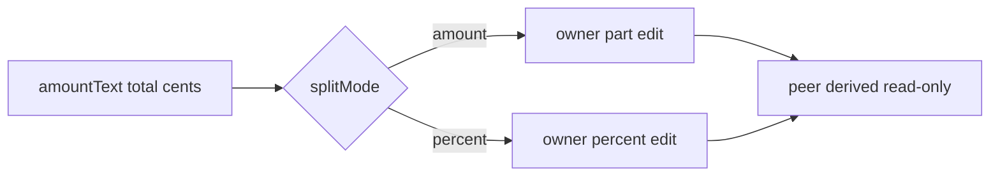


---

## Despesas partilhadas e a receber

*Fonte Cursor:* `despesas_partilhadas_e_a_receber_fbcf3c8a.plan.md`

# Plano: despesas partilhadas avançadas + "a receber"

Este documento **substitui** o plano anterior de roadmap geral. Foca-se na visão que descreveste: partilha com toggle, divisão manual com cálculo assistido, pagamentos independentes por membro, alertas, empréstimos entre membros da família e um ecrã de valores **a receber** (distinto de rendimento até ser liquidado).

## Contexto no código atual

- Já existe base em [`backend/app/models/expense.py`](backend/app/models/expense.py): `is_shared`, `shared_with_user_id` (um par: dono + outro membro), `due_date`, `paid_at`, `status`.
- API e schemas: [`backend/app/schemas/expense.py`](backend/app/schemas/expense.py), [`backend/app/api/routes/expenses.py`](backend/app/api/routes/expenses.py).
- **Limitação atual:** não há divisão (só total), nem estado "quem pagou a sua parte", nem entidade de dívida entre utilizadores.

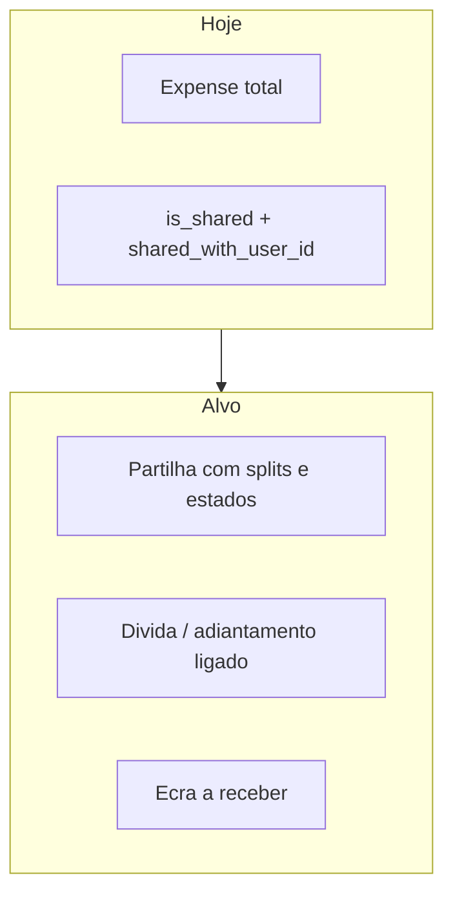

---

## 1. Modelo de dados (backend)

### 1.1 Partilha e divisão

- Manter o toggle **modo partilhar** na criação/edição de despesa; ao ativar, escolher **membro da família** (validar que pertence à mesma família que o criador — reutilizar lógica já usada em `expenses` para `shared_with_user_id`).
- Introduzir **modo de divisão**: `amount` (valores em centavos) ou `percent` (percentagens); ambos **livres** no input, com **validação no servidor**:
  - percentagens: soma = 100 (tolerância de arredondamento, último cêntimo ajustado);
  - valores: soma = `amount_cents` total da despesa.
- Persistir por despesa partilhada (escolha de desenho):
  - **Opção A (recomendada):** tabela `expense_shares` com `expense_id`, `user_id`, `share_cents`, `share_percent` (opcional, espelho), `paid_at`, `status` (`pending` / `paid` / `waived` / `covered_by_peer`).
  - **Opção B:** JSON na linha `expenses` — mais rápido de shippar, pior para queries e integridade.

Campos derivados na API para o cliente: `my_share_cents`, `peer_share_cents`, `i_paid`, `peer_paid`, `split_mode`.

### 1.2 Alertas (sem nova tabela obrigatória)

- **Regra:** na data de vencimento (ou após), se a despesa partilhada não estiver totalmente quitada **e** o outro membro já tiver `paid_at` na sua linha de share → o utilizador em falta vê **indicador de alerta** na lista/detalhe.
- Mensagem ao abrir (detalhe ou bottom sheet): texto do tipo *"X já pagou a parte dele/a dela; falta a tua parte de …"* (copy PT no app).

Isto calcula-se a partir de `expense_shares` + `due_date` + utilizador atual.

### 1.3 Fluxo "não consigo pagar este mês — paga por mim"

- Ação no contexto da despesa partilhada (só para o membro que ainda não pagou): **pedir cobertura** com:
  - montante da parte em falta (default = share do utilizador);
  - **prazo sugerido pelo devedor** para quitar ao credor (`settle_by` date).
- Efeitos:
  1. Marcar a share do devedor como `covered_by_peer` (ou estado equivalente) e registar **quem cobriu** e **quando**.
  2. Criar registo de **dívida / adiantamento** (nova tabela, ex.: `family_balance_entries` ou `iou_entries`): `creditor_user_id`, `debtor_user_id`, `amount_cents`, `due_date`, `source_expense_id`, `status` (`open` / `settled`), timestamps.
  3. Opcional: criar uma **despesa espelho** "empréstimo interno" **só** se quiseres duplicar na lista de despesas; o desenho mais limpo é **uma única fonte de verdade** na tabela de dívidas + referência à despesa original.

### 1.4 "A receber" vs rendimento

- Nova área (lista + detalhe) alimentada por `iou_entries` onde `creditor_user_id == eu` e `status == open`.
- Ação **"Recebi"**:
  - fecha o registo (`settled`);
  - **opcional** (toggle): criar automaticamente um **rendimento** (`incomes`) com categoria sugerida (ex. "Reembolso familiar" / categoria configurável) e montante = valor recebido, com `notes` ligando ao `iou_id` / despesa origem.

Assim distingues **promessa de entrada** (a receber) de **provento** já contabilizado no fluxo mensal.

---

## 2. API (FastAPI)

- Estender `POST/PATCH /expenses` com payload de partilha: modo, splits, membros (mínimo 2 linhas: criador + outro; se no futuro quiseres N vias, o modelo `expense_shares` já escala).
- Novos endpoints sugeridos:
  - `POST /expenses/{id}/shares/{user_id}/mark-paid` (ou um único `PATCH` nas shares).
  - `POST /expenses/{id}/request-cover` com corpo `{ covered_by_user_id, settle_by }`.
  - `GET /receivables` (ou `/family/balance/receivable`) + `POST /receivables/{id}/settle` com `{ create_income: bool, income_category_id?: ... }`.

Autorização: só membros da mesma família; credor/devedor coerentes com a despesa.

---

## 3. Android (Compose)

- **Formulário de despesa:** toggle "Partilhar"; ao ligar → picker de membro + UI de divisão (tab ou segmento **Valor** / **%**), campos editáveis com **totais calculados** e validação visual antes de gravar.
- **Lista e detalhe:** ícone de alerta quando aplicável; linha ou chip por estado ("Tu pagaste", "Falta o outro", etc.).
- **Nova navegação:** rota `NavRoutes` para **A receber** (nome a definir, ex. `receivables`) acessível a partir de Finanças ou definições/perfil familiar.
- **Fluxo cobertura:** diálogo com prazo e confirmação; após sucesso, atualizar lista e possivelmente mostrar snackbar com link para "A receber".

---

## 4. Ordem de implementação sugerida

1. Migração + modelo `expense_shares` + validação de split + respostas enriquecidas nas despesas existentes.
2. Endpoints de marcar parte como paga + lógica de alerta no serializer/listagem.
3. Fluxo `request-cover` + tabela de dívidas + `GET` lista a receber + settle com opção de criar rendimento.
4. UI Android: formulário partilha → lista/detalhe com alertas → ecrã a receber.

---

## 5. Fora de âmbito / decisões explícitas

- **Notificações push:** úteis depois; o plano assume alertas **in-app** primeiro.
- **Admin console:** não é obrigatório para MVP; dados sensíveis — só se no futuro houver suporte com auditoria.
- **Multi-divisão com 3+ pessoas:** o desenho com `expense_shares` suporta; o MVP pode limitar a **2 membros** como hoje (`shared_with`) e expandir depois.

---

## Ficheiros prováveis a tocar

| Área | Ficheiros |
|------|-----------|
| Modelo / migração | Novo `expense_share.py` (ou nome alinhado ao projeto), Alembic, [`expense.py`](backend/app/models/expense.py) relações |
| API | [`expenses.py`](backend/app/api/routes/expenses.py), novos routers se separares recebíveis |
| Schemas | [`expense.py`](backend/app/schemas/expense.py) + novos schemas de balance |
| Android | Formulário despesas, `NavRoutes`, novo ecrã + ViewModel, APIs Retrofit |


---

## Family financial events

*Fonte Cursor:* `family_financial_events_f3d7581c.plan.md`

# Plano: `family_financial` — eventos entre membros

## Objetivo

- Registar **factos** relevantes para relacionamento financeiro (quem fez o quê, quando, quanto, em que despesa), **sem** substituir `expense_shares` nem `family_receivables` (continua a ser a fonte de verdade operacional).
- Uso típico: timeline no cliente, relatórios, suporte e evolução futura (notificações com base em histórico).

## Modelo de dados (proposta)

Nova tabela `family_financial_events` (nome final alinhável ao produto):

| Coluna | Tipo | Notas |
|--------|------|--------|
| `id` | UUID PK | |
| `family_id` | UUID FK → `families.id` (ou equivalente já usado no projeto) | Garante query por família sem inferir só por pares de users |
| `event_type` | `String(48)` | Ver enum abaixo |
| `actor_user_id` | UUID FK → `users.id` | Quem originou a ação |
| `counterparty_user_id` | UUID FK → `users.id` nullable | Outro membro diretamente envolvido (quando aplicável) |
| `amount_cents` | BigInt nullable | Valor monetário associado (ex. parte recusada, valor do recebível) |
| `source_expense_id` | UUID FK → `expenses.id` nullable, `ON DELETE SET NULL` | |
| `source_expense_share_id` | UUID FK → `expense_shares.id` nullable, `ON DELETE SET NULL` | Guardar **antes** de apagar shares no assume-full (ou duplicar id no payload) |
| `source_receivable_id` | UUID FK → `family_receivables.id` nullable | Para settle/cancel |
| `payload_json` | JSON/Text nullable | Detalhes opcionais (`reason`, `installment_group_id`, etc.) sem espalhar colunas |
| `created_at` | timestamptz | Herdar padrão `TimestampMixin` se fizer sentido |

**Índices sugeridos:** `(family_id, created_at DESC)`, `(actor_user_id)`, `(counterparty_user_id)`.

### `event_type` (valores iniciais)

- `peer_declined_share` — parceiro recusou a parte ([`decline_expense_share`](backend/app/api/routes/expenses.py)).
- `owner_assumed_expense_line` — dono assumiu a linha após recusa (`assume_full_expense_share`).
- `cover_requested` — pedido de cobertura criou dívida implícita ([`request_share_cover`](backend/app/api/routes/expenses.py)).
- `receivable_settled` — credor marcou recebido ([`settle_receivable`](backend/app/api/routes/receivables.py)).
- `receivable_cancelled` — recebível fechado sem liquidação (ex. cancelamento ao recusar share — hoje em [`_cancel_open_receivables_for_share`](backend/app/api/routes/expenses.py)).

**Regra:** inserção **síncrona** na mesma transação `db.commit()` do fluxo que já altera o estado — se falhar o insert, falha o fluxo (ou usar savepoint se quiseres tolerância futura).

## Resolução de `family_id`

- Centralizar numa função de serviço (ex. `app/services/family_financial_events.py`): dado `actor_user_id` (e opcionalmente `counterparty_user_id`), obter o `family_id` através da mesma lógica já usada em [`family_scope`](backend/app/services/family_scope.py) / membros da família.
- Se não houver família (edge case), **não** gravar evento ou gravar com `family_id` null só se produto aceitar — preferível falhar silenciosamente em dev log ou exigir família.

## Pontos de emissão (passo a passo no código)

1. **Após** marcar share como `declined` e cancelar recebíveis em `decline_expense_share` → `peer_declined_share` + `receivable_cancelled` por cada recebível fechado (ou um evento agregado com lista de ids em `payload_json` — escolher uma política: N eventos vs 1 evento com array).
2. **Após** `assume_full_expense_share` (limpar shares) → `owner_assumed_expense_line` com `amount_cents` = total da linha e `payload_json` com `installment_number` / `installment_group_id` se útil.
3. **Após** criar `FamilyReceivable` em `request_share_cover` → `cover_requested`.
4. **Após** `settle_receivable` → `receivable_settled` com `source_receivable_id` e `amount_cents`.

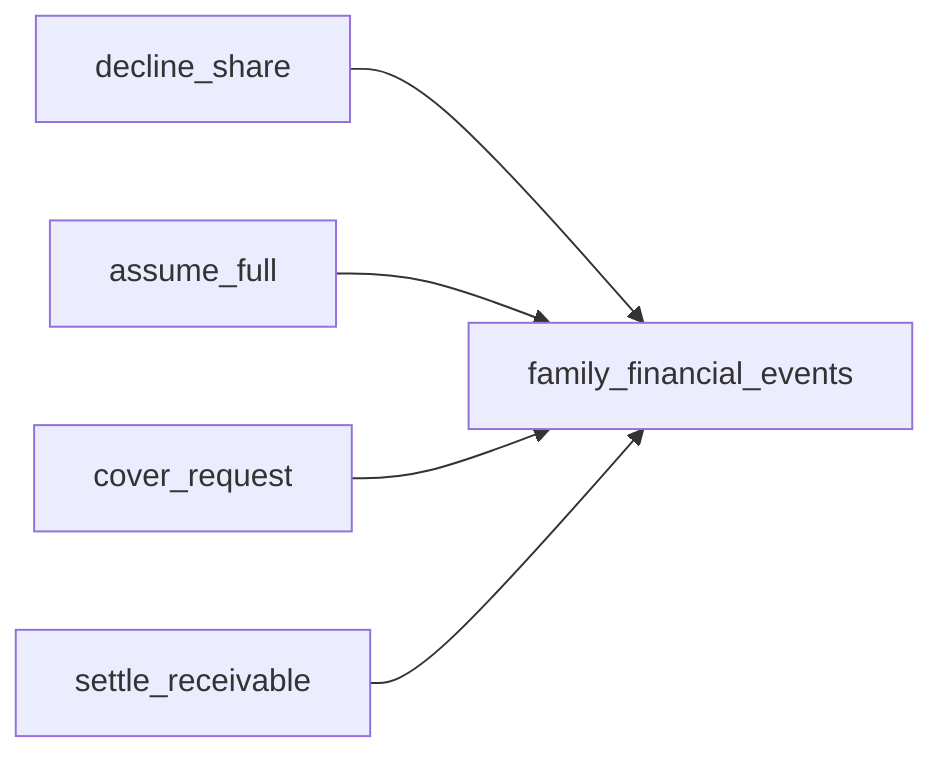

## API (MVP leitura)

- `GET /family/financial-events` (ou `/families/{id}/financial-events` se preferires REST explícito).
- Query params: `limit`, `cursor`/`before_id`, opcional `event_type`.
- Resposta: lista de DTOs com `event_type`, `created_at`, `actor`, `counterparty`, montantes, `source_expense_id`, labels derivados (descrição curta da despesa opcional via join leve).
- **Autorização:** só membros da mesma família; nunca expor famílias cruzadas.

## Cliente Android (fase 2)

- Modelo + endpoint Retrofit; ecrã “Atividade familiar” ou secção no ecrã de saldos ([`receivables`](android-native)) — fora do MVP backend se quiseres ship incremental.

## Testes

- Testes de integração ou unitários do serviço de emissão: após cada ação, conta de eventos e campos obrigatórios.
- Migração Alembic reversível (`upgrade`/`downgrade`).

## Fora de âmbito (explícito)

- Notificações push baseadas em eventos (pode consumir a mesma tabela mais tarde).
- Edição ou eliminação de eventos (tabela append-only).


---

## Índice só raiz

*Fonte Cursor:* `índice_só_raiz_276937cc.plan.md`

# Índice apenas na raiz do projecto

## Objectivo

Ajustar [`docs/PROJECT_FILES_INDEX.md`](d:/Projects/Well Paid/docs/PROJECT_FILES_INDEX.md) para reflectir **só** o que vive na raiz de [`Well Paid`](d:/Projects/Well Paid) — ficheiros e pastas de primeiro nível que servem para **arrancar, fazer deploy, versionar e documentar** o projecto. **Não** incluir árvores internas (`android-native/core/`, `node_modules`, código de bibliotecas, etc.).

## Conteúdo a manter (tabela única na raiz)

Incluir cada entrada listada na raiz (com base no estado actual do repo):

| Entrada | Tipo | Nota para a descrição |
|---------|------|------------------------|
| `README.md` | ficheiro | Entrada do repo |
| `app.py` | ficheiro | Flask legacy (contexto breve) |
| `backend/` | pasta | API FastAPI + Alembic |
| `android-native/` | pasta | APK Kotlin/Compose |
| `mobile/` | pasta | App Flutter |
| `admin-console/` | pasta | SPA admin Vite/React |
| `docs/` | pasta | Documentação do produto |
| `.cursor/` | pasta | Regras Cursor (ex. [`no-env-secrets.mdc`](d:/Projects/Well Paid/.cursor/rules/no-env-secrets.mdc)) |
| `.env` | ficheiro | Variáveis locais (não commitar segredos) |
| `.git/` | pasta | Metadados Git (opcional mencionar como gerado/local) |
| `.gitignore` | ficheiro | Exclusões Git |
| `.pytest_cache/` | pasta | Cache de testes Python (gerado; pode ignorar em backups) |
| `.python-version` | ficheiro | Versão Python para pyenv/tooling |
| `.vercel/` | pasta | Metadados deploy Vercel |
| `.vercelignore` | ficheiro | Ficheiros excluídos do bundle Vercel |
| `wellpaid-release.jks` | ficheiro | Keystore release Android (segredo) |

Separar visualmente **ficheiros** vs **pastas de produto** se ajudar a leitura (duas subsecções curtas ou uma coluna “Tipo”).

## Conteúdo a remover ou substituir

- Apagar as secções que descrevem **dentro** de `backend/`, `android-native/`, `mobile/`, `admin-console/` e a tabela “Onde procurar código por tarefa”.
- Substituir por **uma frase** no fim: para detalhe interno, usar README de cada pacote, [`ANDROID_API_BACKEND_CONTRACT.md`](d:/Projects/Well Paid/docs/ANDROID_API_BACKEND_CONTRACT.md), ou código-fonte — sem listar bibliotecas.

## Ligação noutros docs

- Em [`docs/MASTER_PLAN_AND_ARCHIVE.md`](d:/Projects/Well Paid/docs/MASTER_PLAN_AND_ARCHIVE.md), actualizar a linha que referencia `PROJECT_FILES_INDEX.md` para dizer explicitamente **“só ficheiros e pastas na raiz do repositório”** (evitar expectativa de inventário completo).

## Ficheiros a editar

1. [`docs/PROJECT_FILES_INDEX.md`](d:/Projects/Well Paid/docs/PROJECT_FILES_INDEX.md) — reescrita focada na raiz.
2. [`docs/MASTER_PLAN_AND_ARCHIVE.md`](d:/Projects/Well Paid/docs/MASTER_PLAN_AND_ARCHIVE.md) — uma linha na tabela de documentação complementar.

Não editar o ficheiro do plano mestre em `.cursor/plans` (fora do repo ou preferência do utilizador).


---

## Legacy app.py para stack atual

*Fonte Cursor:* `legacy_app.py_para_stack_atual_05475281.plan.md`

# Plano: legado `app.py` vs Well Paid atual

## Estado atual (após o último deploy)

- **Backend:** [backend/app/services/goal_product_search.py](backend/app/services/goal_product_search.py) — Mercado Livre + SerpAPI `engine=google_shopping` (`httpx`), parsing BRL.
- **Rota:** [backend/app/api/routes/goals.py](backend/app/api/routes/goals.py) — `POST /goals/product-search` junta resultados ML + Google Shopping quando `SERPAPI_KEY` está definida ([backend/app/core/config.py](backend/app/core/config.py)).
- **Listas de compras:** [backend/app/api/routes/shopping_lists.py](backend/app/api/routes/shopping_lists.py) — CRUD, checkout, totais; itens em [backend/app/models/shopping_list_item.py](backend/app/models/shopping_list_item.py) têm `label`, `quantity`, `line_amount_cents` — **não** há endpoint de “buscar preço na internet” nem histórico de comparações como no legado.
- **Vercel:** Com `SERPAPI_KEY` no painel, o deploy de produção passa a expor a pesquisa enriquecida em metas; não é necessário código extra para “ligar” a chave além de já estar em `Settings`.

## O que o `app.py` faz que importa para o produto atual

| Área no legado | Trecho típico | Situação no projeto atual |
|----------------|----------------|---------------------------|
| Busca de preço (SerpAPI) | `POST /api/search-price` — `engine: google`, query `"{item} preço {unit} Blumenau SC supermercado"`, `shopping_results` e fallback em `organic_results` com regex | **Parcialmente coberto** para **metas** com `google_shopping` + ML; **listas de compras** ainda sem API equivalente. |
| Localização na query | Fixo Blumenau / `gl=br` / `location` | Atual: `gl=br`, `hl=pt-br`, sem cidade na string — pode alinhar com preferência do utilizador se quiserem resultados mais locais. |
| Comparação de preços por item | `price_comparisons` (internet / meta / pago, estatísticas) | **Não existe** no modelo FastAPI — seria feature nova (migração + rotas). |
| Metas | `/metas`, `/contribute_goal`, etc. | **Já existe** modelo e API de goals com contribuições e referência de preço ([backend/app/models/goal.py](backend/app/models/goal.py)). |
| Resto (dashboard HTML, sessões, Flutter paralelo) | Muitas rotas `/` | **Fora de escopo** de port direto; referência só de regras de negócio. |

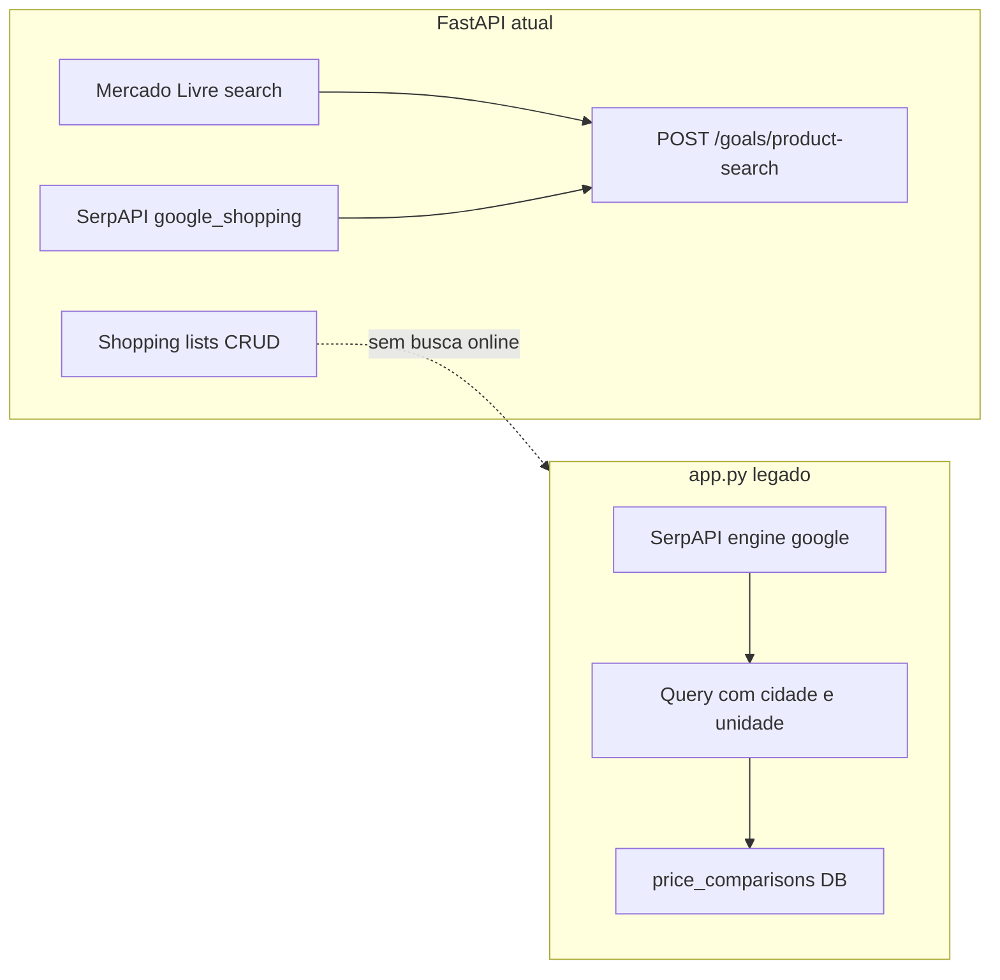

**Nota:** quando existir o endpoint **grocery** para listas, o diagrama pode evoluir para `SL --> GroceryPrice[grocery price-suggestions]` reutilizando `ML` e `SP2` com *query shaping* específico.

## Reutilização recomendada (por prioridade)

1. **Serviço de pesquisa partilhado (alto valor, baixo risco)**  
   Extrair ou reutilizar as funções já em [goal_product_search.py](backend/app/services/goal_product_search.py) para um endpoint dedicado à **lista de compras** (ver secção *Grocery* abaixo), por exemplo `POST /shopping-lists/price-suggestions` com corpo que inclua o nome do item, unidade opcional e **contexto grocery**, devolvendo a mesma forma de hits (título, `price_cents`, URL, `source`). Evita duplicar chamadas SerpAPI/ML e mantém uma única política de limites e erros.

2. **Alinhar comportamento ao legado só onde fizer sentido (médio)**  
   - **Query enriquecida:** opcionalmente concatenar unidade e cidade (settings de perfil ou `DEFAULT_SHOPPING_LOCATION` em config), espelhando a ideia de `search_query` do legado.  
   - **Fallback orgânico:** o legado usa `organic_results` + regex se não houver shopping; hoje o fluxo de metas depende de `shopping_results`. Pode acrescentar um segundo passo (ou `engine=google` leve) **só** quando o primeiro retornar vazio, com cuidado com custo SerpAPI e rate limits.

3. **Histórico de comparações de preço (baixo se não for prioridade de produto)**  
   Só vale migrar o conceito de `price_comparisons` se quiserem analytics “paguei X vs internet Y” por item de lista — implica tabela nova, permissões família, e UI Android. É o maior investimento em relação ao legado.

4. **Não portar como cópia**  
   O pacote Python `serpapi.GoogleSearch` do legado — o atual usa `httpx` à API REST; manter **um** cliente HTTP evita dependência extra e já está testado no backend.

## Lista de compras: foco mercearia (grocery)

**Escopo de produto (acordado):** a lista de compras deve usar pesquisa de preço **voltada a itens de mercado no sentido clássico de grocery** — exemplos que o utilizador citou: **feijão**, **trigo** (farinha / derivados), **açúcar**, e em geral **todo o tipo de produto** que se compra em supermercado, padaria associada, mercearia seca, enlatados, laticínios básicos, bebidas da cesta, higiene/limpeza quando entram na mesma lista. **Não** é o foco principal deste fluxo pesquisar eletrónica, mobiliário ou categorias típicas de “metas de poupança” genéricas; para isso continua a existir o fluxo de **metas** com `product-search` mais aberto.

Objetivo: aplicar o **mesmo conceito** de pesquisa de preço (ML + SerpAPI) ao fluxo da lista de compras, com resultados úteis para **produtos de supermercado** (grocery). Isto alinha-se ao espírito do legado (`"... supermercado"` na query), mas no stack atual fica explícito como **modo grocery**, distinto de metas onde o utilizador pode pesquisar artigos mais genéricos (eletrónica, etc.).

**Exemplos de categorias / itens alvo (não exaustivo):**

- **Grãos e leguminosas:** feijão, lentilha, grão-de-bico, ervilha seca.
- **Cereais e farinhas:** arroz, trigo (farinha / misturas), fubá, aveia, milho para pipoca.
- **Açúcares e adoçantes:** açúcar cristal / refinado, adoçante (se o rótulo do utilizador for específico).
- **Óleos e gorduras:** óleo de soja/girassol, margarina.
- **Laticínios e ovos:** leite UHT, iogurte, manteiga, ovos (dúzia).
- **Mercearia seca:** massas, molhos básicos, sal, fermento, temperos comuns.
- **Enlatados / conservas:** atum, sardinha, extrato de tomate, milho em conserva.
- **Bebidas:** água, suco, refrigerante (se fizer parte da cesta).
- **Limpeza e higiene básica:** detergente, papel higiênico, sabonete (quando o utilizador os coloca na lista de compras).

Tudo isto entra no mesmo modo **grocery**: a heurística de query (supermercado + local) aplica-se ao texto que o utilizador escreveu no item, independentemente da categoria.

**Comportamento desejado (produto):**

- O utilizador, ao editar ou adicionar um **item de lista**, pode pedir “sugestões de preço” com base no **rótulo** do item (e opcionalmente **quantidade/unidade** já guardadas no item: kg, L, pacote).
- A **string de pesquisa** enviada aos motores deve favorecer mercearia: por exemplo concatenar `"{rótulo} {unidade}"` com termos como `supermercado` ou `mercado` e, quando existir preferência de **cidade/região** (perfil ou config), o mesmo padrão do `app.py` — `"{...} {cidade} {UF}"` — para aproximar preços de retalho local em vez de apenas marketplaces genéricos.
- **Fontes:** manter **Mercado Livre** (muitos itens embalados com preço visível) + **Google Shopping** via SerpAPI; o utilizador vê `source` nas sugestões e escolhe uma referência para preencher `line_amount_cents` ou só como referência visual.
- **Diferenciação técnica opcional:** parâmetro `search_context: "grocery" | "general"` (ou endpoint separado só para lista) para o backend montar queries diferentes — *grocery* com sufixos de supermercado/local; *general* (ou rota de metas atual) sem forçar esse sufixo. Assim metas e listas partilham serviço mas não misturam heurísticas.

**Android:** no ecrã da lista de compras, ação por item (“Preço / sugerir”) que chama o novo endpoint com o texto do item + unidade; resultados em lista semelhante ao fluxo de metas, com copy claro de que valores são **indicativos** (lojas e embalagens variam).

**Fora de âmbito imediato:** histórico `price_comparisons` do legado continua como backlog; o MVP da grocery é **sugestão pontual** por item, não obrigatoriamente gravar cada comparação.

## Verificação pós-deploy (manual)

- Chamar `POST /goals/product-search` com JWT e corpo `{"query":"notebook","site_id":"MLB"}` contra a URL de produção.  
- Confirmar que com `SERPAPI_KEY` aparecem entradas com `source: "google_shopping"` misturadas com `mercadolibre`.
- **Quando existir o endpoint da lista (grocery):** testar com queries próximas do utilizador real, por exemplo `feijão carioca 1kg`, `açúcar cristal`, `farinha de trigo tipo 1`, e verificar que os resultados tendem a embalagens de varejo (e não só eletrónica ou categorias irrelevantes).

## Próximo passo sugerido

**Prioridade acordada para evolução:** **(A)** trazer “busca de preço” para a **lista de compras** com foco **mercearia / grocery** (reutilizar serviço existente + *query shaping* dedicado). Opcional em paralelo: **(B)** aprofundar **metas** (fallback orgânico, localização na query) se o produto quiser paridade extra com o legado. A opção (A) aproxima o `app.py` (`supermercado` + local) sem exigir o modelo `price_comparisons` no primeiro entregável.

## Onde os planos do Cursor ficam guardados

- **Por defeito (este plano):** ficheiros `.plan.md` no perfil local, pasta `C:\Users\andri\.cursor\plans\` (ex.: este ficheiro `legacy_app.py_para_stack_atual_05475281.plan.md`). Não entram automaticamente no Git do projeto.
- **Opcional no repositório:** o Cursor pode também usar `[repo]/.cursor/plans/` — convém verificar se existe nessa pasta ao abrir o projeto.
- **Decisão do utilizador:** arquivar cópias versionadas em **`docs/plans/`** no Well Paid (Markdown), para histórico e partilha no Git. Executar na fase de implementação: criar `docs/plans/`, copiar ou exportar o conteúdo relevante dos `.plan.md` do perfil, e fazer commit.


---

## Próximas features Well Paid

*Fonte Cursor:* `próximas_features_well_paid_27744ec2.plan.md`

# Próximas implementações: admin, backend e Android

## Estado atual (resumo)

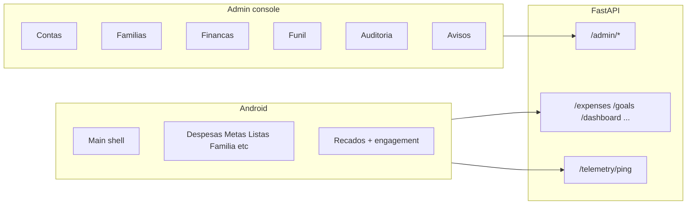

- **Backend** ([`backend/app/main.py`](backend/app/main.py)): domínio completo (auth, dashboard, despesas, rendimentos, categorias, metas, famílias, reserva, listas, telemetria mínima, anúncios).
- **Admin** ([`admin-console/src/App.tsx`](admin-console/src/App.tsx) + [`admin-console/src/api.ts`](admin-console/src/api.ts)): alinhado com [`backend/app/api/routes/admin.py`](backend/app/api/routes/admin.py) — uso (`/usage/summary`), finanças agregadas, funil, auditoria, utilizadores (lista/detalhe/patch), famílias (lista/detalhe), CRUD de avisos.
- **Android** ([`NavRoutes.kt`](android-native/app/src/main/java/com/wellpaid/navigation/NavRoutes.kt)): cobre o núcleo do produto; recados com vários placements carregados em [`HomeViewModel.kt`](android-native/app/src/main/java/com/wellpaid/ui/home/HomeViewModel.kt) (`home_banner`, `home_feed`, `finance_tab`, `announcements_tab`) e ecrã dedicado de recados.

**Telemetria** ([`telemetry.py`](backend/app/api/routes/telemetry.py)): apenas `app_open`, dedupe 1/dia — alimenta DAU/MAU no admin mas não dá funil por ecrã.

---

## Lacunas e oportunidades (por impacto)

### Alta prioridade (produto / operação)

1. **Notificações push para avisos** — Hoje os recados dependem de abrir a app. **Backend**: modelo `device_token` (FCM), endpoint de registo, job ou envio síncrono ao publicar/segmentar. **Android**: Firebase Cloud Messaging, pedido de permissão, handling de deep link para [`NavRoutes.Announcements`](android-native/app/src/main/java/com/wellpaid/navigation/NavRoutes.kt) ou URL in-app.
2. **Consola de suporte “read-only”** — Rotas admin já mostram utilizador e família; falta visão **read-only** de dados de suporte (últimas despesas/rendimentos/metas por `user_id`) sem SQL manual. Estende [`admin.py`](backend/app/api/routes/admin.py) + secção no admin com máximo de privacidade e auditoria.
3. **Export / relatórios no admin** — CSV ou Excel para lista de utilizadores, eventos de auditoria, ou engagement de avisos (já há dados no backend para anúncios).

### Média prioridade (engajamento e dados)

4. **Telemetria além de `app_open`** — Ex.: `screen_view` com amostragem ou limite diário por tipo, para enriquecer o funil sem explodir custo de DB. Exige alteração em [`telemetry.py`](backend/app/api/routes/telemetry.py), política de privacidade e UI no admin para novos cortes.
5. **UX explícita do placement `finance_tab`** — O merge em [`HomeViewModel`](android-native/app/src/main/java/com/wellpaid/ui/home/HomeViewModel.kt) já inclui `finance_tab` no conjunto de recados; se o objetivo de produto for “banner no separador Finanças”, falta **superfície dedicada** no UI de despesas/rendimentos (hoje pode estar só na lista global de recados).
6. **Objetivos e alertas no admin** — Painel simples: contas inativas X dias, famílias sem despesas, taxa de conversão do funil com metas (os dados já existem em parte em [`/admin/metrics/funnel`](backend/app/api/routes/admin.py)).

### Menor prioridade / polish

7. **Widgets Android** (saldo ou próxima meta) — Só cliente; sem dependência obrigatória de backend novo.
8. **Internacionalização** — Se o admin for usado por equipa PT/EN, i18n no React.
9. **Migrações e deploy** — Manter rotina `alembic upgrade head` em produção após novas migrações (ex. histórico de engagement de avisos).

---

## Sugestão de ordenação

| Fase | Entrega |
|------|---------|
| 1 | Push FCM + registo de tokens + deep link para recados |
| 2 | Endpoints admin read-only de suporte + secção mínima na consola |
| 3 | Export CSV (utilizadores / auditoria / engagement) |
| 4 | Telemetria de ecrã (opcional) + documentação de privacidade |

---

## Nota de âmbito

O pedido é amplo; a priorização acima assume **máximo impacto para utilizadores e equipa interna** com esforço controlado. Se o foco for apenas **uma** vertente (ex. só marketing/recados ou só suporte), a ordem pode mudar.


---

## Recusa partilha e assumir

*Fonte Cursor:* `recusa_partilha_e_assumir_9378707b.plan.md`

# Plano: recusar partilha, alerta ao criador e assumir despesa (com parcelas)

## O que já existe (base para evoluir)

- [`ExpenseShare`](backend/app/models/expense_share.py): `status` (`pending`, `paid`, `waived`, `covered_by_peer`), `share_cents`, vínculo a uma **linha** `expenses.id`.
- [`share_resolved`](backend/app/services/expense_splits.py): considera “fechada” a parte com `paid` / `waived` / `covered_by_peer`.
- **Parcelamento**: cada parcela é uma **linha separada** em `expenses` com o mesmo `installment_group_id`; as shares são copiadas por parcela na criação ([`expenses.py`](backend/app/api/routes/expenses.py)). Logo, **recusa e “assumir só” são naturalmente por parcela** se as ações forem sempre sobre `expense_id` concreto — não é preciso “herdar” recusa para todas as parcelas futuras salvo produto decidir o contrário.
- **Cobertura** ([`request_share_cover`](backend/app/api/routes/expenses.py)): cria [`FamilyReceivable`](backend/app/models/family_receivable.py) ligado a `source_expense_share_id`.

```mermaid
sequenceDiagram
  participant Peer
  participant API
  participant Owner
  Peer->>API: declineShare(expenseId)
  API->>Owner: alerta na despesa criada
  Owner->>API: assumeFull(expenseId)
  API: ajusta shares ou is_shared=false
```

---

## 1. Novo estado e semântica

- Adicionar `status = declined` (ou `rejected`) na **parte do parceiro** (`ExpenseShare` do `user_id` que recusa).
- **`declined` não entra em `share_resolved`** (continua a exigir ação do dono), exceto depois de resolvido por “assumir” na **linha em causa** (ver §2 e §3).
- Opcional: coluna `declined_at`, `decline_reason` (texto curto) na própria `expense_shares` para histórico e UI.

---

### Semântica “assumir” (produto)

- **Compra parcelada** (várias linhas com o mesmo `installment_group_id`): o dono **nunca** “assume o plano inteiro” com um único botão. A ação **assume** aplica-se **só ao `expense_id` da parcela vigente** (a linha onde houve recusa). Outras parcelas mantêm o split original até haver recusa nessa linha.
- **Compra não parcelada** (uma única linha = compra completa): a mesma ação **assume o total dessa linha**, que coincide com o total da compra — aqui é natural falar em “assumir tudo” no sentido de **uma única despesa**.

O nome do endpoint pode permanecer técnico (`assume-full` = assumir o valor integral **daquela linha**); na UI, usar copy distinta: p.ex. “Assumir esta parcela” vs “Assumir a despesa” conforme haja ou não parcelamento.

---

## 2. APIs sugeridas (FastAPI)

| Endpoint | Quem | Efeito |
|----------|------|--------|
| `POST /expenses/{id}/share/decline` | Só o **parceiro** (linha da sua parte) | Marca a sua share como `declined`; se existir **recebível aberto** ligado a esta share (`FamilyReceivable` + `source_expense_share_id`), **cancelar/ fechar** com motivo (evita dívida fantasma). |
| `POST /expenses/{id}/share/assume-full` | Só o **criador** (`owner_user_id`) | Resolve o impasse **nesta linha** (`id`): atribuir o montante total **da linha** ao dono — por exemplo `peer` share → `waived` com `share_cents=0` e **aumentar** `owner` share para `amount_cents` **ou** tornar a linha **não partilhada** (`is_shared=false`, `shared_with_user_id=null`, apagar `expense_shares`). Não propaga a outras parcelas do grupo. |
| (Opcional) `GET` já enriquecido | — | Novos campos em [`ExpenseResponse`](backend/app/schemas/expense.py): `shared_expense_peer_declined_alert` (boolean, para o **dono**), `my_share_declined` (para o parceiro), mensagens derivadas. |

Reutilizar [`compute_share_extras`](backend/app/services/expense_splits.py) para calcular:
- Dono: alerta se existe share do parceiro `declined` e a linha ainda não foi “assumida” (definir critério: `is_shared` ainda true **ou** flag `owner_acknowledged` — ver §4).

---

## 3. Parcelas (mês a mês)

- **Regra de produto**: recusa e “assumir” aplicam-se **apenas ao `expense_id` da parcela vigente** em que o parceiro agiu — **não** é “assumir todas as parcelas restantes” nem o capital total do bem.
- Parcelas **posteriores** mantêm o plano original (duas partes) até alguém recusar nessa parcela — alinhado ao pedido (“decidir sempre na parcela daquele mês”).
- Documentar no cliente: ao abrir o **plano de prestações**, cada linha tem o seu estado de partilha independente; o CTA do dono deve deixar claro que é **esta parcela** (e não o contrato inteiro).

---

## 4. “Relacionamento financeiro” com o outro utilizador

Duas camadas possíveis (escolher uma para MVP):

- **Mínimo**: não criar tabela nova; usar `FamilyReceivable` + histórico de `expense_shares` (status/timestamps) para consultas futuras.
- **Recomendado para evolução**: tabela `family_financial_events` (nome a definir) com `event_type` (`peer_declined_split`, `owner_assumed_full`, `cover_opened`, `receivable_settled`), `actor_user_id`, `counterparty_user_id`, `expense_id`, `expense_share_id`, `amount_cents`, `payload_json` opcional. Serve a dashboards e a “memória” entre membros sem duplicar regras de negócio.

---

## 5. Interações a não esquecer (compatibilidade)

1. **Ordem cobertura vs recusa**: se o parceiro pediu cobertura e o credor ainda não “recebeu” no mundo real, recusa deve **invalidar** o `FamilyReceivable` aberto dessa share (ou transição `cancelled`).
2. **`sync_expense_row_from_shares`**: com uma parte `declined`, o total **não** deve marcar a despesa como `paid` até `assume-full` ou o dono pagar a linha inteira conforme modelo escolhido.
3. **Pagamento (`/pay`)**: parceiro com `declined` não deve poder marcar “pago” nessa parte; dono paga o valor total **dessa linha** após assume (comportamento já próximo do fluxo não partilhado). Em parcelamento, outras linhas do grupo não são afetadas.
4. **Edição**: após `declined`, restringir edição de splits pelo parceiro; dono pode usar só `assume-full` ou editar após conversão para não partilhada (política explícita no API).
5. **Android**: ecrã despesa — botão “Não aceito pagar a minha parte” (peer); banner + CTA “Assumir sozinho” (dono); lista de despesas — ícone/alerta para o dono; **parcelas**: mesmo fluxo por linha no detalhe da parcela.

---

## 6. Ordem de implementação sugerida

1. Migração: novos valores/campos em `expense_shares`; atualizar `share_resolved` e `compute_share_extras`.
2. `decline` + limpeza de `FamilyReceivable` pendente.
3. `assume-full` na linha (definir se prefere `is_shared=false` ou shares ajustadas); garantir que não altera outros `expense_id` do mesmo `installment_group_id`.
4. Eventos opcionais (`family_financial_events`).
5. Schemas + testes de integração mínimos.
6. Android: DTOs, ações no [`ExpenseFormViewModel`](android-native/app/src/main/java/com/wellpaid/ui/expenses/ExpenseFormViewModel.kt) / ecrãs alinhados ao plano de parcelas.

---

## Decisão de produto a fixar antes de codificar

- **Após `assume-full` na linha**, preferes manter essa linha como **despesa privada do dono** (`is_shared=false`, total inalterado) ou manter `is_shared=true` com partes 100/0? A primeira opção simplifica listagens e relatórios. (Âmbito sempre **uma** `expense_id`; nunca o grupo de parcelas inteiro.)


---

## Redesign Admin Console

*Fonte Cursor:* `redesign_admin_console_9636bd96.plan.md`

# Plano de Redesign do Admin Console (Material/SaaS)

## Objetivo
Evoluir o `admin-console` para um layout mais maduro e profissional, com melhor aproveitamento de tela, UX de dados mais eficiente e base técnica modular para evoluções rápidas.

## Estado atual (diagnóstico)
- Estrutura principal concentrada em [`D:/Projects/Well Paid/admin-console/src/App.tsx`](D:/Projects/Well Paid/admin-console/src/App.tsx), dificultando consistência visual e manutenção.
- Container global limitado em [`D:/Projects/Well Paid/admin-console/src/index.css`](D:/Projects/Well Paid/admin-console/src/index.css) com `max-width: 1200px`, reduzindo uso de área útil em telas amplas.
- Uso extensivo de estilos inline e escalas de espaçamento/tipografia pouco padronizadas.
- Tabelas e filtros funcionais, porém com UX de produtividade abaixo do padrão moderno (densidade, ações rápidas, hierarquia e responsividade avançada).

## Estratégia de implementação

### Fase 1 — Foundation UI (Design tokens + shell)
- Expandir sistema de tokens em [`D:/Projects/Well Paid/admin-console/src/index.css`](D:/Projects/Well Paid/admin-console/src/index.css):
  - escala de espaçamento (ex.: 4/8/12/16/24/32),
  - tipografia (display/title/body/caption),
  - elevação/sombra, bordas e estados interativos,
  - cores semânticas (surface, border, success, warning, danger, info).
- Substituir root estreito por layout responsivo full-screen com limites contextuais por seção (analytics vs formulários).
- Definir shell moderno: app bar superior + navegação lateral colapsável + área de conteúdo com grid consistente.

### Fase 2 — Modularização da aplicação
- Quebrar [`D:/Projects/Well Paid/admin-console/src/App.tsx`](D:/Projects/Well Paid/admin-console/src/App.tsx) em módulos por domínio:
  - `sections/users/*`
  - `sections/families/*`
  - `sections/finance/*`
  - `sections/funnel/*`
  - `sections/audit/*`
- Criar componentes de base reutilizáveis (ex.: `PageHeader`, `StatCard`, `FilterBar`, `DataTable`, `EmptyState`, `SidePanel`, `ConfirmDialog`).
- Centralizar padrões de layout e remover estilos inline repetidos.

### Fase 3 — UX de produtividade (tabelas e filtros)
- Evoluir tabelas com padrão SaaS moderno:
  - cabeçalho sticky,
  - densidade configurável (comfortable/compact),
  - ações de linha agrupadas,
  - estados de loading/empty/error mais claros,
  - melhor responsividade para colunas críticas.
- Reestruturar barras de filtros em blocos lógicos (busca, status, data, ações), com colapso inteligente em telas menores.
- Priorizar legibilidade de dados com hierarquia forte e redução de ruído visual.

### Fase 4 — Dashboard e maturidade visual
- Redesenhar cards de métricas e painéis analíticos para ocupar melhor áreas largas sem parecer “espalhado”.
- Introduzir padrões de seção: cabeçalho + KPIs + conteúdo principal + ações secundárias.
- Alinhar microinterações (hover/focus/pressed) para percepção de produto mais premium.

### Fase 5 — Qualidade, performance e rollout
- Garantir que a nova estrutura preserve fluxos atuais já ligados a [`D:/Projects/Well Paid/admin-console/src/api.ts`](D:/Projects/Well Paid/admin-console/src/api.ts).
- Revisar acessibilidade básica (contraste, foco por teclado, labels).
- Validar responsividade em breakpoints principais (desktop amplo, laptop, tablet).
- Entrega incremental por seção para reduzir risco de regressão.

## Fluxo alvo de arquitetura
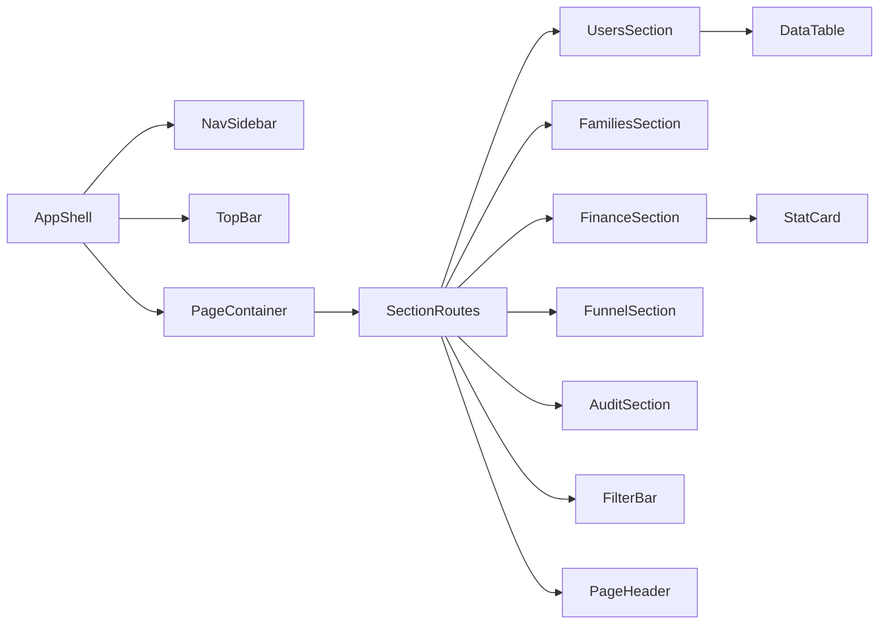

## Critérios de sucesso
- Interface ocupa melhor a tela em desktop sem perder legibilidade.
- Navegação e hierarquia visual claras em todas as seções.
- Redução substancial de estilos inline e duplicação de estrutura.
- Tabelas/filtros com experiência comparável a admin SaaS moderno.
- Manutenção mais simples com componentes reutilizáveis por domínio.

---

## Reservas e Metas v2

*Fonte Cursor:* `reservas_e_metas_v2_f0c5c643.plan.md`

# Plano: reservas múltiplas + metas enriquecidas

## Estado actual (referência)

- **Reserva**: [`EmergencyReserve`](backend/app/models/emergency_reserve.py) com `family_id` / `solo_user_id` **únicos** (1 reserva por escopo). Créditos mensais em [`EmergencyReserveAccrual`](backend/app/models/emergency_reserve.py); serviço em [`emergency_reserve.py`](backend/app/services/emergency_reserve.py) (acréscimos automáticos, `amount_cents >= 0` em [`patch_accrual_for_user`](backend/app/services/emergency_reserve.py)). UI Android: [`EmergencyReserveContent.kt`](android-native/app/src/main/java/com/wellpaid/ui/emergency/EmergencyReserveContent.kt).
- **Metas**: modelo [`Goal`](backend/app/models/goal.py) com `title`, `target_cents`, `current_cents`; API [`goals.py`](backend/app/api/routes/goals.py) / DTOs Android [`GoalDtos.kt`](android-native/core/model/src/main/java/com/wellpaid/core/model/goal/GoalDtos.kt).

## 1) Reserva de emergência — desenho proposto

### Modelo de dados (conceito)

- **Vários planos de reserva** por mesmo escopo (família ou utilizador solo): cada plano tem nome, `monthly_target_cents`, `tracking_start`, **`plan_duration_months`** (ou `plan_end_date` derivado), estado (`active` / `completed` / `archived`).
- **Histórico mensal por plano**: manter linhas por mês com **valor depositado** (actual) e, na UI, **esperado = meta mensal**; **déficit do mês = esperado − depositado** (quando depositado &lt; esperado). Isto pode ser **calculado** (sem gravar negativo na mesma coluna) ou representado por um tipo de linha “ajuste/déficit” — ver opções abaixo.
- **Fim do plano** (confirmado por ti: **transferência lógica**): ao completar o período, o saldo acumulado do plano deve poder ser **associado a uma meta** ou **a outro plano de reserva** (movimento interno: debitar plano origem, creditar destino), preservando auditoria.

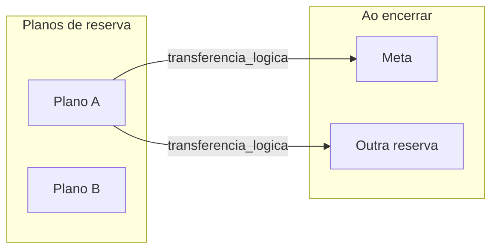

### Fases de implementação sugeridas

1. **Migração PostgreSQL**: nova tabela `emergency_reserve_plans` (ou equivalente) com FK para escopo (família/solo como hoje), campos de meta mensal, datas, duração, estado; migrar dados da linha única actual para um plano “legado” para não perder histórico; mover `emergency_reserve_accruals` para `plan_id` em vez de `reserve_id` antigo (ou renomear FK de forma clara).
2. **Regras de negócio**: recalcular `ensure_accruals` por **plano**; definir o que acontece quando há **múltiplos planos activos** (recomendação: permitir vários, cada um com a sua meta mensal).
3. **API FastAPI**: CRUD de planos, listagem de meses com **depositado / esperado / déficit** (DTO derivado), endpoint de **transferência ao encerrar** (origem, destino tipo `goal` | `reserve_plan`, montante ou saldo total).
4. **Android**: lista de planos, detalhe com linha mensal “**+ depositado** / **− reserva faltante**” (**só via l10n**, ver secção 6), wizard de criação (nome, valor/mês, N meses), e fluxo de **encerrar e redireccionar** para meta ou outra reserva.

### Opções de melhoria (além da tua sugestão) — **Reserva**

| Ideia | Benefício |
|--------|-----------|
| **Registo único de “déficit”** (campo calculado vs. linha `adjustment` na BD) | Calculado: mais simples; linha na BD: melhor para relatórios/exportação |
| **Alertas** (notificação no último dia do mês se déficit &gt; 0) | Reforço comportamental sem complicar o core |
| **Prioridade entre planos** | Ordem de “onde contar primeiro” se o utilizador quiser simular cortes |
| **Congelar meta mensal** após início do plano | Evita reescrita retroactiva do esperado (política de produto) |
| **Export CSV / partilha** do histórico mensal | Transparência e arquivo |

## 2) Metas — formulário e preço de referência

### Campos novos (mínimo)

- `title` (já existe), **`target_url`** (opcional, validado URL), **`target_cents`**, **`reference_price_cents`** opcional, **`reference_currency`** (default BRL), **`price_checked_at`** (timestamp), talvez **`price_source`** (`manual` \| `fetched` \| `unavailable`).
- **Ofertas alternativas (produto)**: guardar **lista estruturada** (ex.: JSONB ou tabela `goal_price_alternatives`) com pelo menos até N entradas (mínimo desejado na UI: **3**): `label` (loja ou título curto), `price_cents`, `url` opcional, `fetched_at`, `confidence`/`source` — para mostrar “3 alternativas” sem sobrescrever o preço principal às cegas.

### Actualização de preço “por link”

Não existe **API gratuita universal** que devolva o preço correcto para qualquer loja nem **três comparativos fiáveis** só com o URL, sem uma segunda fonte (busca, parceiro pago, ou marketplace com API pública).

**O que é possível (alinhado à tua ideia):**

1. **Consulta “pelo link primário”**: no servidor, fazer fetch controlado da página e extrair **nome principal** (prioridade típica: `og:title`, `schema.org/Product.name`, `<title>`, primeiro `h1`) e **um preço** (JSON-LD `offers.price`, OG, microdados). Isto alimenta a **referência principal** da meta.
2. **Consulta auxiliar por nome (e opcionalmente por preço como filtro)**: usar o **nome extraído** (e, se útil, o preço detectado como *faixa* ou *ordenar por proximidade*) para uma **segunda chamada** que devolva **várias ofertas**. Aqui entram as limitações:
   - **Mercado Livre** (e similares com API ou endpoint de busca documentado): é **realista** pedir busca por texto e devolver **≥3 resultados** com preços diferentes (ofertas não são garantidamente o *mesmo* SKU; são “alternativas de mercado”).
   - **Loja arbitrária** sem API: não há como garantir 3 preços reais sem **scraping agressivo** (frágil, legalmente arriscado) ou **API paga** tipo agregador de preços / Google Shopping via fornecedor pago.
3. **“Pelo preço”**: usar o valor só como **filtro de relevância** (ex.: descartar resultados muito baratos/caros) ou **ordenar** candidatos; raramente substitui o nome na busca.

**Estratégia recomendada no plano de execução:**

- **MVP honesto**: (A) extrair **1 preço + nome** da URL; (B) se o domínio for **suportado** (primeiro candidato: Mercado Livre), chamar **busca por nome** e preencher **até 3 alternativas** a partir dos hits; (C) se não houver fonte de alternativas, mostrar **apenas a referência da página** + opção **manual** para o utilizador colar 2–3 preços ou links (ou menos de 3 com aviso “alternativas indisponíveis”).
- **Evolução**: integrar **API paga** de comparação se o produto precisar de cobertura multi-loja global.

### Fases

1. Migração `goals` + schemas Pydantic + respostas API + DTOs Kotlin (incluir array/lista de alternativas).
2. Serviço backend: `extractProductHint(url)` → nome + preço principal; `fetchAlternatives(hint)` com **plugins por domínio** (ML primeiro) + fallback sem 3 itens.
3. Endpoint `POST /goals/{id}/refresh-reference-price` (ou assíncrono) que devolve **principal + até N alternativas** e persiste com `price_checked_at`.
4. Formulário Android: URL, lista de **≥1 preço principal** e **até 3 alternativas** quando existirem, indicador de fonte e última actualização.

### Opções de melhoria (além da tua sugestão) — **Metas**

| Ideia | Benefício |
|--------|-----------|
| **Barra “falta comprar”** = `reference_price_cents - current_cents` quando há preço | Liga poupança ao item concreto |
| **Screenshot ou ícone** obtido do OG `image` | UI mais rica |
| **Metas partilhadas na família** (já há visibilidade por peers) + comentários | Colaboração |
| **Alerta quando preço referência sobe** (comparar com último fetch) | Motivação e replaneamento |
| **Duplicar meta** para variantes (cor/tamanho) | Menos fricção |

## 3) Riscos e decisões técnicas

- **Migração da reserva actual**: obrigatório mapear dados existentes para o novo modelo sem perda de `balance_cents` e accruals.
- **Déficit “negativo” na UI**: o backend pode expor `expected_cents`, `deposited_cents`, `shortfall_cents` por mês sem armazenar montantes negativos nas mesmas tabelas de crédito — alinha com a regra actual `amount_cents >= 0`.
- **Transferência ao encerrar**: implementar como **transacção** na BD (origem/destino, montante, `recorded_at`) para auditoria.
- **Preço por URL**: tratar como **melhor esforço**, nunca como fonte financeira oficial.
- **Três alternativas**: compromisso de produto = **“até 3 quando a fonte permitir”**; para URLs genéricos, **não prometer** três comparativos automáticos sem integração paga ou domínio com busca pública.

## 4) Ordem de entrega sugerida

1. Modelo e API de **planos de reserva** + migração + transferência para **meta / outra reserva** no encerramento.  
2. UI Android reserva (lista, detalhe com déficit, fluxo de redireccionamento).  
3. Extensão de **metas** (URL + preço) + refresh no backend + formulário Android.

**Paralelizar quando fizer sentido:** preparar **navegação e layouts** do APK (secção 5) com **dados mock ou API antiga** para validar UX antes do backend estar fechado — reduz retrabalho visual.

Ficheiros centrais a tocar: [`backend/app/models/emergency_reserve.py`](backend/app/models/emergency_reserve.py), novo serviço/migração, [`backend/app/api/routes/emergency_reserve.py`](backend/app/api/routes/emergency_reserve.py), [`android-native/.../EmergencyReserve*`](android-native/app/src/main/java/com/wellpaid/ui/emergency/), [`backend/app/models/goal.py`](backend/app/models/goal.py), [`backend/app/api/routes/goals.py`](backend/app/api/routes/goals.py), [`GoalDtos.kt`](android-native/core/model/src/main/java/com/wellpaid/core/model/goal/GoalDtos.kt), ecrãs em `ui/goals/`.

## 5) Android (APK): preparar o frontend para as mudanças e formulários alinhados ao projecto

Objetivo: o utilizador ver **fluxos coerentes e “bonitos”** com o resto do Well Paid — mesma linguagem visual que já usam [`EmergencyReserveContent.kt`](android-native/app/src/main/java/com/wellpaid/ui/emergency/EmergencyReserveContent.kt) e [`GoalFormScreen.kt`](android-native/app/src/main/java/com/wellpaid/ui/goals/GoalFormScreen.kt) (`WellPaidNavy` / `WellPaidGold`, `wellPaidTopAppBarColors()`, `RoundedCornerShape` nos campos e botões primários, `wellPaidScreenHorizontalPadding` / largura máxima onde já existir).

### Navegação e ecrãs

- **Rotas** em [`WellPaidNavHost.kt`](android-native/app/src/main/java/com/wellpaid/navigation/WellPaidNavHost.kt): novas rotas para **lista de planos de reserva**, **detalhe/editar plano**, **wizard criar plano**, **ecrã encerrar + escolher destino** (meta vs outra reserva); para metas, reutilizar `GoalFormScreen` / `GoalDetailScreen` com argumentos ou rotas dedicadas se o fluxo crescer.
- **Scaffold + TopBar**: manter `CenterAlignedTopAppBar` e ícones brancos como em `GoalFormScreen` para consistência entre criar/editar meta e novos ecrãs de reserva.

### Formulários “bonitos” e usáveis

- **Secções claras** (título + espaçamento): ex. “Dados da meta”, “Link do produto”, “Preço de referência”, “Alternativas”; para reserva: “Identificação do plano”, “Meta mensal e duração”, “Resumo”.
- **Campos**: `OutlinedTextField` com cantos arredondados como na reserva; para valores monetários, reutilizar o padrão existente (`WellPaidMoneyDigitKeypadField` ou equivalente já usado noutros ecrãs de dinheiro).
- **Estados**: `CircularProgressIndicator` no refresh de preço; mensagens de erro em `MaterialTheme.colorScheme.error` (como `EmergencyReserveContent`); estados vazios com texto `onSurfaceVariant`.
- **Listas de alternativas de preço**: pequenos **cards** ou linhas com preço + origem + link opcional (abrir no browser), sem poluir o formulário — scroll vertical único com `imePadding()` como em `GoalFormScreen`.
- **Acessibilidade**: `contentDescription` em ícones; botões de acção principal com ouro (`WellPaidGold`) e texto navy onde já for o padrão do ecrã.

### Conteúdo e l10n

- **Obrigatório:** seguir a secção **6) Localização (l10n)** — nenhum texto de utilizador em literais dentro dos composables.

### Componentização (opcional mas recomendado)

- Extrair **composables reutilizáveis** no estilo do projecto: `WellPaidFormSection(title)`, `WellPaidPrimaryButton` (wrapper dos `ButtonDefaults` dourados), lista de “resultado de preço” — evita cópia inconsistente entre metas e reservas.

### Ordem prática no APK

1. Definir rotas + ecrãs vazios ou com **placeholder** alinhados ao tema.  
2. Evoluir [`GoalFormScreen.kt`](android-native/app/src/main/java/com/wellpaid/ui/goals/GoalFormScreen.kt) para os novos campos e secções.  
3. Refactor / expandir área de emergência para **multi-plano** mantendo o cartão-hero e a hierarquia visual actuais onde fizer sentido.

## 6) Localização (l10n) — requisito transversal (Android)

**Regra:** todo o texto **visível ao utilizador** nestes fluxos (metas enriquecidas, reservas multi-plano, erros, estados vazios, botões, títulos de secção, `contentDescription` de ícones, mensagens de snackbar/dialog) deve residir em **recursos de string**, com **paridade** entre os locales que o projecto suporta hoje.

### Onde e como

- **Ficheiros base:** [`android-native/app/src/main/res/values/strings.xml`](android-native/app/src/main/res/values/strings.xml) (default, tipicamente inglês) e [`android-native/app/src/main/res/values-pt-rBR/strings.xml`](android-native/app/src/main/res/values-pt-rBR/strings.xml) (português Brasil).
- **Adicionar chaves novas em ambos** no mesmo PR / entrega — evitar “só inglês” ou “só PT” temporário salvo excepção explícita de produto.
- **Strings com parâmetros:** usar `stringResource(R.string.foo, arg1, …)` e definir placeholders (`%1$s`, `%2$d`, etc.) nos dois XML; para quantidades (“N meses”, “N alternativas”), preferir [`plurals`](https://developer.android.com/guide/topics/resources/string-resource#Plurals) em `values` e `values-pt-rBR` quando a gramática o exigir (PT/EN diferem pouco em plural, mas meses/alternativas podem precisar de `one/other`).
- **Datas e números:** reutilizar formatação já usada no app (ex. `formatBrlFromCents`, formatadores de data) para respeitar locale; não concatenar manualmente símbolos de moeda em string fixa se já existir utilitário centralizado.
- **Erros vindos da API:** mapear códigos ou `detail` estável para **chaves** `R.string.*` no cliente (evitar mostrar mensagens cruas do servidor como única cópia localizada, a menos que o projecto já faça isso noutros ecrãs — nesse caso, alinhar ao padrão existente).

### Critério de aceitação

- Revisão de código: **zero** `Text("...")` / `stringResource` omitido para cópia nova de produto nos ecrãs tocados; `contentDescription` também referenciado em strings (ou `cd_` keys dedicadas).
- Checklist manual: mudar idioma do sistema (ou `AppCompat` / recurso de teste) e confirmar que **não** aparecem fallbacks em inglês só num dos ecrãs.

### Backend (nota)

- Dados persistidos (nome da meta, nome do plano de reserva) são **conteúdo do utilizador**, não l10n do sistema. Mensagens de validação **só no cliente** via strings; no servidor, preferir códigos de erro para o app traduzir.


---

## Swipe navegação abas Android

*Fonte Cursor:* `swipe_navegação_abas_android_f20371f6.plan.md`

# Plano: gestos de swipe entre Início e abas (APK Android)

## Estado atual (relevante)

- **Abas principais** estão em [`MainShellScreen.kt`](d:/Projects/Well Paid/android-native/app/src/main/java/com/wellpaid/ui/main/MainShellScreen.kt): `selectedTab` 0=Início, 1=Despesas, 2=Proventos, 3=Metas, 4=Reserva. O **«A pagar»** usa o atalho `navigateToExpensesPending()` e fica na mesma aba Despesas (1), por isso os mesmos gestos aplicam-se.
- **Gráficos na Home** usam `HorizontalPager` com 2 páginas em [`HomeDashboardContent.kt`](d:/Projects/Well Paid/android-native/app/src/main/java/com/wellpaid/ui/home/HomeDashboardContent.kt) — deve **manter-se intocado** na aba 0.
- **Lista de compras** é rota à parte (`NavRoutes.ShoppingLists` em [`WellPaidNavHost.kt`](d:/Projects/Well Paid/android-native/app/src/main/java/com/wellpaid/navigation/WellPaidNavHost.kt)), não é uma aba do `NavigationBar`.

## Semântica dos gestos (LTR layout)

Alinhado ao que descreveste e ao que confirmaste para a última aba:

| Gesto (dedo) | Efeito nas abas 1–3 | Efeito na aba 4 (Reserva) |
|--------------|---------------------|---------------------------|
| **Esquerda → direita** (conteúdo «empurrado» como voltar) | `selectedTab = 0` (Início) | `selectedTab = 0` (Início) |
| **Direita → esquerda** (avançar) | `selectedTab + 1` | `selectedTab = 0` (Início) — opção **wrap_home** que escolheste |

Assim, na Reserva o «avançar» leva ao dashboard; o «voltar» também leva ao Início — comportamento previsível e sem aba «6.ª».

**Lista de compras:** recomendação — **só** o gesto que leva a Início (esquerda→direita): `popBackStack()` + sinalizar no [`savedStateHandle`](d:/Projects/Well Paid/android-native/app/src/main/java/com/wellpaid/navigation/WellPaidNavHost.kt) do `NavRoutes.Main` (ex.: `main_shell_select_tab` = 0) e um `LaunchedEffect` em `MainShellScreen` para consumir o pedido uma vez. O gesto «próxima» neste ecrã é ambíguo (não há ordem de abas visível); evitar RTL ou mapear para algo explícito (ex.: fechar só) fica como decisão fina na implementação.

## Abordagem técnica (Compose)

1. **Não** envolver a Home e as outras abas num único `HorizontalPager` externo sem cuidado — **conflito garantido** com o `HorizontalPager` interno dos gráficos.
2. **Aplicar gestos só quando `selectedTab != 0`**: um `Modifier` reutilizável (ex. `Modifier.mainShellHorizontalSwipe(...)`) em [`MainShellScreen.kt`](d:/Projects/Well Paid/android-native/app/src/main/java/com/wellpaid/ui/main/MainShellScreen.kt) no `Box` que envolve o `when (selectedTab)` **ou** repartido por ecrã, usando `pointerInput` + deteção de arrastamento horizontal com:
   - **Limiar mínimo** de distância e/ou velocidade para não trocar aba ao fazer scroll vertical nas `LazyColumn`.
   - Preferência por movimento **mais horizontal que vertical** (comparar deltas acumulados) antes de consumir o gesto.
3. **RTL / LTR**: usar `LayoutDirection` (`LocalLayoutDirection`) para que em locale RTL os sentidos físicos continuem coerentes com «voltar ao Início» vs «avançar» na ordem lógica das abas.
4. **Feedback**: `HapticFeedbackType.TextHandleMove` ou `Confirm` ao mudar de aba (API estável, boa prática Material).

Ficheiros prováveis a tocar:

- [`MainShellScreen.kt`](d:/Projects/Well Paid/android-native/app/src/main/java/com/wellpaid/ui/main/MainShellScreen.kt) — modifier + leitura do `savedStateHandle` para tab inicial após voltar da lista de compras.
- Novo ficheiro pequeno em `ui/main/` ou `ui/gestures/` — lógica de gesto isolada e testável.
- Opcional: [`ShoppingListsScreen.kt`](d:/Projects/Well Paid/android-native/app/src/main/java/com/wellpaid/ui/shopping/ShoppingListsScreen.kt) + um ajuste mínimo em [`WellPaidNavHost.kt`](d:/Projects/Well Paid/android-native/app/src/main/java/com/wellpaid/navigation/WellPaidNavHost.kt) para escrever o tab no `mainEntry` ao fechar com swipe.

## Testes manuais sugeridos

- Despesas / Proventos / Metas: LTR → Início; RTL → aba seguinte.
- Reserva: LTR → Início; RTL → Início.
- Despesas com lista a fazer scroll longo: scroll vertical não deve mudar aba.
- Home: apenas pager dos dois gráficos; **nenhum** salto de aba por swipe horizontal no corpo (só o pager interno).
- Lista de compras: swipe para Início não deve deixar a app num estado de tab errado.

## UX / funcionalidades Android recentes (aplicáveis ao vosso stack)

- **Edge-to-edge e barras do sistema** — já há tratamento parcial na Home; manter consistência ao adicionar gestos (nada a mudar obrigatoriamente).
- **Háptico** ao mudar de aba por gesto — baixo custo, melhora perceção (Material 3).
- **Acessibilidade**: gestos horizontais não são óbvios para todos; o `NavigationBar` e o botão «voltar» na top bar continuam a fonte de verdade. Opcional: **nota breve** num futuro ecrã de ajuda ou onboarding (fora do âmbito mínimo).
- **Predictive back** (Android 13+): o sistema já anima o back por gesto; o vosso swipe «para Início» é **complementar** ao back stack nas abas (não substitui `popBackStack` nas rotas empilhadas). Em ecrãs de detalhe continua a usar-se o back normal.
- **Per-app language** (API 33+) e **notificações** — relevantes a médio prazo, não para este gesto em concreto.

Nada disto exige subir `compileSdk` além do 35 já usado em [`app/build.gradle.kts`](d:/Projects/Well Paid/android-native/app/build.gradle.kts).

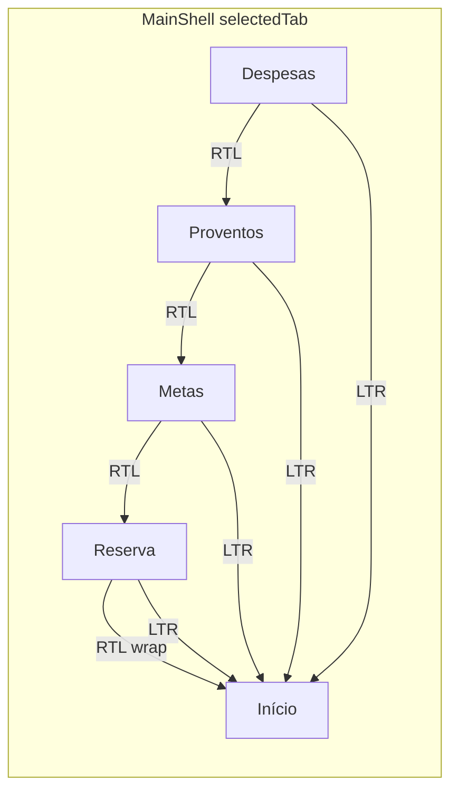


---

## Tela de Avisos Admin

*Fonte Cursor:* `tela_de_avisos_admin_40b98a86.plan.md`

# Plano: Tela de Avisos + Operação Contínua do Admin Console

## Objetivo do produto
Criar uma funcionalidade de conteúdo editorial para o Well Paid, onde admins publicam avisos, dicas financeiras e materiais curtos; os usuários veem isso no app em formato de banner/feed, com agendamento e controle de visibilidade.

## Estado atual relevante
- O painel já possui estrutura de seções e padrão de tabelas/ações em [admin-console/src/App.tsx](admin-console/src/App.tsx), [admin-console/src/api.ts](admin-console/src/api.ts) e componentes em [admin-console/src/components/admin-ui.tsx](admin-console/src/components/admin-ui.tsx).
- O backend não possui entidade/API de conteúdo ainda; hoje há rotas administrativas e telemetria em [backend/app/api/routes/admin.py](backend/app/api/routes/admin.py) e [backend/app/main.py](backend/app/main.py).
- O app mobile e Android nativo não têm feed de conteúdo gerido por backend neste momento.

## Fluxo funcional proposto
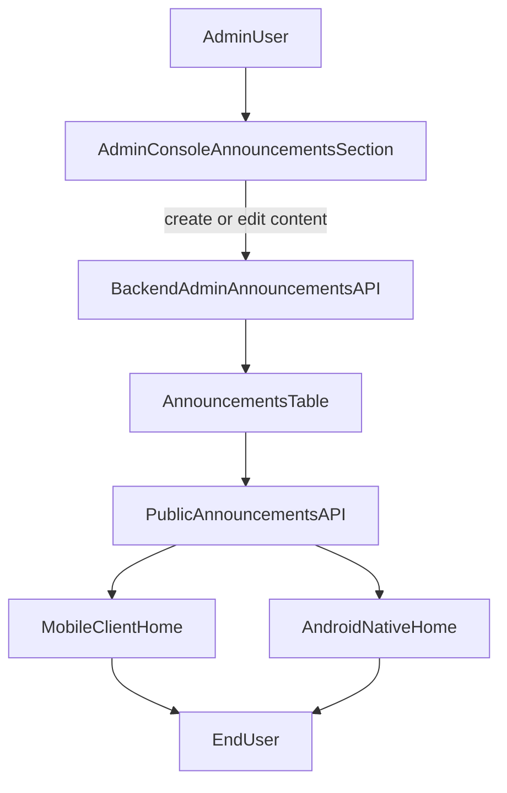

## Modelo mínimo (MVP)
- Entidade `Announcement` com campos:
  - `id`, `title`, `body`, `kind` (`info|warning|tip|material`), `placement` (`home_banner|home_feed|finance_tab`), `is_active`
  - `starts_at`, `ends_at`, `created_at`, `updated_at`, `created_by`
- Regras de publicação:
  - Só aparece para usuário final quando `is_active=true` e dentro da janela de data.
  - Conteúdo expirado sai automaticamente da listagem pública.
- Escopo inicial sem push notification (somente in-app). Push pode ser fase 2.

## APIs sugeridas
- Admin (protegido por admin):
  - `GET /admin/announcements`
  - `POST /admin/announcements`
  - `PATCH /admin/announcements/{id}`
  - `POST /admin/announcements/{id}/publish` e `/unpublish` (opcional)
- Público autenticado (usuário app):
  - `GET /announcements/active?placement=home_banner`

## Mudanças por camada
- **Backend**
  - Criar model + migration + schemas + rotas de anúncio.
  - Integrar router novo em [backend/app/main.py](backend/app/main.py).
  - Reusar dependência admin para proteção de endpoints administrativos em [backend/app/api/deps.py](backend/app/api/deps.py).
- **Admin Console**
  - Adicionar seção `announcements` na navegação em [admin-console/src/App.tsx](admin-console/src/App.tsx).
  - Implementar tela com lista + filtros + modal de criação/edição (mesmo padrão das seções atuais) em `admin-console/src/sections/AnnouncementsSection.tsx`.
  - Adicionar client functions e types em [admin-console/src/api.ts](admin-console/src/api.ts).
- **Clientes (app)**
  - Consumir endpoint público e renderizar bloco de avisos na Home (começando por banner único + “ver mais”).

## UX/admin recomendada
- Status visual por item: `Rascunho`, `Publicado`, `Agendado`, `Expirado`.
- Pré-visualização simples antes de publicar.
- Campo de CTA opcional (`cta_label`, `cta_url`) para materiais educativos.
- Ordenação por prioridade e data de início.

## Operação no Windows (admin console sempre disponível)
Estratégia recomendada: **deixar o dev server em execução automática no login e abrir em navegador dedicado**.

1. Criar script `start-admin-console.ps1` para:
   - abrir terminal em `admin-console`
   - rodar `npm run dev -- --host`
   - aguardar porta (ex: 5173) e abrir `http://localhost:5173`
2. Registrar no **Task Scheduler** com trigger “At logon” e opção “Run whether user is logged on or not” conforme necessidade.
3. Criar atalho no desktop para abrir/fechar rápido quando quiser manutenção manual.
4. Para edição livre:
   - manter projeto no editor normalmente; o hot reload reflete alterações sem reiniciar toda hora.
5. Evolução opcional para mais estabilidade:
   - build + preview (`npm run build && npm run preview`) ou empacotar em desktop shell (Tauri/Electron) se desejar app fixo.

## Fases de implementação
- Fase 1 (MVP): CRUD admin + endpoint público + banner na Home.
- Fase 2: feed completo com categorias e histórico de leitura.
- Fase 3: push notifications e segmentação por perfil/família.

## Critérios de aceitação
- Admin consegue criar, editar, ativar e desativar avisos no painel.
- Usuário final vê apenas avisos ativos e no período válido.
- Alteração no painel aparece no app sem atualização de versão.
- Admin console inicia automaticamente no Windows sem exigir abertura manual repetitiva.

---

## Verificação despesas por etapas

*Fonte Cursor:* `verificação_despesas_por_etapas_8e97e781.plan.md`

# Plano: verificação de despesas passo a passo

## Contexto já mapeado no repositório

- Migração Alembic presente: [backend/alembic/versions/004_expense_installments.py](d:\Projects\One Pay\backend\alembic\versions\004_expense_installments.py) (colunas `installment_total`, `installment_number`, `installment_group_id`, `recurring_frequency`).
- Modelo e API: [backend/app/models/expense.py](d:\Projects\One Pay\backend\app\models\expense.py), [backend/app/api/routes/expenses.py](d:\Projects\One Pay\backend\app\api\routes\expenses.py), schema [backend/app/schemas/expense.py](d:\Projects\One Pay\backend\app\schemas\expense.py).
- Validação **parcelas vs recorrência no create** já existe no schema (`model_validator` em `ExpenseCreate`):

```29:35:d:\Projects\One Pay\backend\app\schemas\expense.py
    @model_validator(mode="after")
    def parcelas_ou_recorrente(self) -> ExpenseCreate:
        if self.installment_total > 1 and self.recurring_frequency is not None:
            raise ValueError(
                "Use parcelas OU recorrência, não ambos (Telas §5.6)."
            )
        return self
```

- Criação parcelada: `_split_amounts_cents`, `_add_months` em [expenses.py](d:\Projects\One Pay\backend\app\api\routes\expenses.py); resposta do `POST` devolve só a primeira linha (reload por `first_id`).
- Mobile: páginas em [mobile/lib/features/expenses/presentation/](d:\Projects\One Pay\mobile\lib\features\expenses\presentation\); rede com refresh em [mobile/lib/core/network/dio_client.dart](d:\Projects\One Pay\mobile\lib\core\network\dio_client.dart).
- Testes backend com nome que contém `expense`: [backend/tests/test_expense_schemas.py](d:\Projects\One Pay\backend\tests\test_expense_schemas.py) (o `pytest -k expense` do prompt deve apanhar estes).

## Como vamos trabalhar (uma etapa por vez)

Após aprovação deste plano, em **cada mensagem tua** pedimos **só a próxima etapa** (ex.: “Etapa 2”). Em cada etapa o agente:

1. Executa os comandos sugeridos no prompt (quando aplicável).
2. Revê os ficheiros listados no checklist.
3. Entrega o **critério de fecho** do documento (lista objetiva, matriz OK/Falha, ou passos manuais).
4. **Não** implementa melhorias; só regista *gaps*. Corrigir código só se explicitamente pedires nessa etapa.

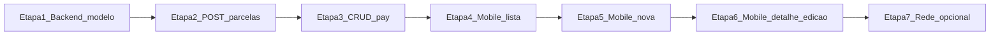

## Etapa 1 — Backend: modelo e migração

- Correr em `backend`: `alembic current`; `pytest tests/ -q --tb=no -k expense`.
- Confirmar alinhamento: migração `004`, modelo SQLAlchemy, campos em `ExpenseResponse` (já visíveis em `_to_response`).
- Fecho: ficheiros revistos + confirmação da regra parcelas/recorrência + revisão do head Alembic.

## Etapa 2 — Backend: criação parcelada e resposta

- Rever lógica do loop em `create_expense` (N linhas, `installment_group_id`, `installment_number` 1..N, soma dos `amount_cents`, datas com `_add_months`).
- Opcional: teste manual com API ou teste automatizado novo **só se** quiseres cobertura explícita (o prompt aceita observação sem novo código).
- Fecho: descrição do comportamento + referência a `POST /expenses`.

## Etapa 3 — Backend: CRUD geral e pay

- `GET /expenses` com `year`/`month`/`status` e presença dos campos `installment_*` / `recurring_frequency` na resposta.
- `PUT`: política para parcelas vs `recurring_frequency` (código atual aplica `model_dump` genérico; verificar se o mobile envia valores coerentes — pode ser *gap* a reportar).
- `POST .../pay` e `DELETE`: 401 sem JWT, 404 para id inexistente (confirmar com testes rápidos ou leitura de `get_current_user` / rotas).
- Fecho: matriz curta operação → esperado → OK/Falha.

## Etapa 4 — Mobile: lista e atalhos

- `flutter analyze` em `expense_list_page.dart`.
- Checklist UI: atalho no corpo, FAB, padding, chips parcela/recorrência (ler `expense_item.dart` / providers se necessário para labels).
- Fecho: checklist + resultado do analyze.

## Etapa 5 — Mobile: nova despesa

- Rever `new_expense_page.dart` + invalidação de providers após create (checklist do prompt).
- Fecho: passos manuais numerados + resultado (ou nota “requer dispositivo/emulador”).

## Etapa 6 — Mobile: detalhe e edição

- `flutter analyze` em `expense_detail_page.dart` e `expense_edit_page.dart`.
- Checklist: detalhe parcela/recorrência, banner em edição parcelada, dropdown recorrência.
- Fecho: checklist + analyze.

## Etapa 7 — Rede e sessão (opcional)

- Revisão só leitura de `dio_client.dart` (interceptor 401/refresh, evitar loop) e impacto nas operações de despesas.
- Fecho: nota breve sem expor tokens.

## Leitura opcional pré-Etapa 1

- `Ordems 1.md` §4.1 (centavos), se existir no projeto.

*Nota:* existia um segundo ficheiro Cursor com o mesmo nome de plano e corpo vazio (`verificação_despesas_por_etapas_b943890b.plan.md`); foi **removido** da pasta de planos por ser duplicado.

---

# Parte III — Contrato API, QA E2E e índice da raiz

Texto integral dos ficheiros [`ANDROID_API_BACKEND_CONTRACT.md`](./ANDROID_API_BACKEND_CONTRACT.md), [`E2E_QA_CHECKLIST.md`](./E2E_QA_CHECKLIST.md) e [`PROJECT_FILES_INDEX.md`](./PROJECT_FILES_INDEX.md) na data de consolidação (mantêm-se também como ficheiros separados para edição).

---

## Contrato Android ↔ API (documentação viva)
Este ficheiro cruza os **interfaces Retrofit** (`android-native/core/network`) e **DTOs Kotlin** (`android-native/core/model`) com a **API FastAPI** em `backend/app`. Mantém-se alinhado ao código; para alterações de contrato, actualize este ficheiro na mesma PR.

## Origem da API e `app.py`

- O APK usa `BuildConfig.API_BASE_URL` (ver `android-native/app/build.gradle.kts`): deve ser a **origem** do deploy FastAPI (ex. `https://….vercel.app/`), **sem** path extra — os paths abaixo são relativos a essa origem.
- O ficheiro na raiz [`app.py`](../app.py) é a aplicação **Flask** legacy (páginas HTML e fluxos antigos). O cliente Android consome a API **REST JSON** servida por [`backend/app/main.py`](../backend/app/main.py).
- **OpenAPI interactiva:** `GET /docs` e `GET /openapi.json` no mesmo host que o FastAPI.

## Mapa por domínio

Legenda: **Retrofit** = método em `core/network`; **DTOs** = ficheiros típicos em `core/model`; **Backend** = router + schemas Pydantic em `backend/app`.

### Autenticação e perfil

| Método | Path | Retrofit | DTOs (Kotlin) | Backend |
|--------|------|----------|---------------|---------|
| POST | `/auth/register` | `AuthApi.register` | `RegisterRequestDto`, `RegisterResponseDto` | `auth.py` → `RegisterRequest`, `RegisterResponse` |
| POST | `/auth/verify-email` | `AuthApi.verifyEmail` | `VerifyEmailRequestDto`, `TokenPairDto` | `VerifyEmailRequest`, `TokenPairResponse` |
| POST | `/auth/resend-verification` | `AuthApi.resendVerification` | `ResendVerificationRequestDto`, `ResendVerificationResponseDto` | `ResendVerificationRequest`, `ResendVerificationResponse` |
| POST | `/auth/login` | `AuthApi.login` | `LoginRequestDto`, `TokenPairDto` | `LoginRequest`, `TokenPairResponse` |
| POST | `/auth/refresh` | `AuthApi.refresh` / `refreshCall` | `RefreshRequestDto`, `TokenPairDto` | `RefreshRequest`, `TokenPairResponse` |
| POST | `/auth/logout` | `AuthApi.logout` | `LogoutRequestDto`, `MessageResponseDto` | `LogoutRequest`, `MessageResponse` |
| POST | `/auth/forgot-password` | `AuthApi.forgotPassword` | `ForgotPasswordRequestDto`, `ForgotPasswordResponseDto` | `ForgotPasswordRequest`, `ForgotPasswordResponse` |
| POST | `/auth/reset-password` | `AuthApi.resetPassword` | `ResetPasswordRequestDto`, `MessageResponseDto` | `ResetPasswordRequest`, `MessageResponse` |
| GET | `/auth/me` | `UserApi.getCurrentUser` | `UserMeDto` | `UserMeResponse` |
| PATCH | `/auth/me` | `UserApi.patchProfile` | `UserProfilePatchDto`, `UserMeDto` | `UserProfilePatch`, `UserMeResponse` |
| POST | `/auth/profile/display-name` | `UserApi.updateDisplayName` | `UserProfilePatchDto`, `UserMeDto` | mesmo `UserMeResponse` |

Paths sem Bearer no header: ver `AuthPaths.kt` (`/auth/login`, `/auth/register`, etc.).

### Dashboard

| Método | Path | Retrofit | DTOs | Backend |
|--------|------|----------|------|---------|
| GET | `/dashboard/overview` | `DashboardApi.overview` | `DashboardOverviewDto` | `dashboard.py` → `DashboardOverviewResponse` |
| GET | `/dashboard/cashflow` | `DashboardApi.cashflow` | `DashboardCashflowDto` | `DashboardCashflowResponse` |

### Despesas

| Método | Path | Retrofit | DTOs | Backend |
|--------|------|----------|------|---------|
| GET | `/expenses` | `ExpensesApi.listExpenses` | `ExpenseDto` | `ExpenseResponse` (lista) |
| GET | `/expenses/{id}` | `ExpensesApi.getExpense` | `ExpenseDto` | `ExpenseResponse` |
| POST | `/expenses` | `ExpensesApi.createExpense` | `ExpenseCreateDto`, `ExpenseCreateOutcomeDto` | `ExpenseCreate`, `ExpenseCreateOutcome` |
| PUT | `/expenses/{id}` | `ExpensesApi.updateExpense` | `ExpenseUpdateDto`, `ExpenseDto` | `ExpenseUpdate`, `ExpenseResponse` |
| DELETE | `/expenses/{id}` | `ExpensesApi.deleteExpense` | — | query `delete_target`, `delete_scope`, `confirm_delete_paid` |
| POST | `/expenses/{id}/pay` | `ExpensesApi.payExpense` | `ExpensePayDto`, `ExpenseDto` | `ExpensePayRequest`, `ExpenseResponse` |
| POST | `/expenses/{id}/share/cover-request` | `ExpensesApi.requestShareCover` | `ExpenseCoverRequestDto`, `ExpenseDto` | `ExpenseCoverRequest`, `ExpenseResponse` |
| POST | `/expenses/{id}/share/decline` | `ExpensesApi.declineExpenseShare` | `ExpenseShareDeclineDto`, `ExpenseDto` | `ExpenseShareDeclineRequest`, `ExpenseResponse` |
| POST | `/expenses/{id}/share/assume-full` | `ExpensesApi.assumeFullExpenseShare` | `ExpenseDto` | `ExpenseResponse` |

### Rendimentos e categorias

| Método | Path | Retrofit | DTOs | Backend |
|--------|------|----------|------|---------|
| GET/POST | `/incomes`, `/incomes/{id}` | `IncomesApi` | `IncomeDto`, `IncomeCreateDto`, `IncomeUpdateDto` | `incomes.py` → `IncomeResponse`, … |
| GET/POST | `/income-categories` | `IncomeCategoriesApi` | `IncomeCategoryDto`, `IncomeCategoryCreateRequest` | `income_categories.py` |

### Categorias de despesa

| Método | Path | Retrofit | DTOs | Backend |
|--------|------|----------|------|---------|
| GET/POST | `/categories` | `CategoriesApi` | `CategoryDto`, `CategoryCreateRequest` | `categories.py` → `category_public.py` |

### Metas

| Método | Path | Retrofit | DTOs | Backend |
|--------|------|----------|------|---------|
| CRUD | `/goals`, `/goals/{id}` | `GoalsApi` | `GoalDto`, `GoalCreateDto`, `GoalUpdateDto` | `goals.py` → `GoalResponse`, … |
| POST | `/goals/{id}/contribute` | `GoalsApi.contribute` | `GoalContributeDto`, `GoalDto` | `GoalContribute*` (schema em `goal.py`) |
| POST | `/goals/{id}/refresh-reference-price` | `GoalsApi.refreshReferencePrice` | `GoalDto` | `GoalResponse` |
| POST | `/goals/preview-from-url` | `GoalsApi.previewFromUrl` | `GoalPreviewFromUrlRequestDto`, `GoalPreviewFromUrlDto` | `GoalPreviewFromUrlResponse` |
| POST | `/goals/product-search` | `GoalsApi.productSearch` | `GoalProductSearchRequestDto`, `GoalProductSearchResponseDto` | `GoalProductSearchResponse` |

O backend expõe também `GET /goals/{goal_id}/contributions` (histórico); o APK pode obter dados agregados via `getGoal` conforme necessidade.

### Família

| Método | Path | Retrofit | DTOs | Backend |
|--------|------|----------|------|---------|
| GET/POST/PATCH/DELETE | `/families/me`, `/families/join`, … | `FamiliesApi` | `FamilyDtos.kt` | `families.py` → `family.py` |

### Reserva de emergência

| Método | Path | Retrofit | DTOs | Backend |
|--------|------|----------|------|---------|
| Vários | `/emergency-reserve`, `/emergency-reserve/accruals`, `/emergency-reserve/plans`, … | `EmergencyReserveApi` | `EmergencyReserveDtos.kt` | `emergency_reserve.py` → `emergency_reserve` schemas |

### Valores a receber (receivables)

| Método | Path | Retrofit | DTOs | Backend |
|--------|------|----------|------|---------|
| GET | `/receivables` | `ReceivablesApi.listReceivables` | `ReceivablesListDto` | lista + metadados em `receivable.py` |
| POST | `/receivables/{id}/settle` | `ReceivablesApi.settleReceivable` | `SettleReceivableDto`, `ReceivableDto` | `SettleReceivableRequest`, `ReceivableOut` |

### Listas de compras

| Método | Path | Retrofit | DTOs | Backend |
|--------|------|----------|------|---------|
| GET/POST/PATCH/DELETE | `/shopping-lists`, `/shopping-lists/{id}`, items, complete | `ShoppingListsApi` | `ShoppingListDtos.kt` | `shopping_lists.py` → `shopping_list.py` |
| POST | `/shopping-lists/price-suggestions` | `ShoppingListsApi.groceryPriceSuggestions` | `GoalProductSearchResponseDto` (reutilizado) | `GoalProductSearchResponse` |

### Anúncios

| Método | Path | Retrofit | DTOs | Backend |
|--------|------|----------|------|---------|
| GET | `/announcements/active` | `AnnouncementsApi.listActive` | `AnnouncementListDto` | `AnnouncementListResponse` |
| POST | `/announcements/{id}/read` | `AnnouncementsApi.markRead` | `ApiOkResponse` | resposta OK |
| POST | `/announcements/{id}/hide` | `AnnouncementsApi.hide` | `ApiOkResponse` | idem |

### Telemetria

| Método | Path | Retrofit | DTOs | Backend |
|--------|------|----------|------|---------|
| POST | `/telemetry/ping` | `TelemetryApi.ping` | `TelemetryPingRequestDto`, `TelemetryPingResponseDto` | `telemetry.py` |

## Rotas FastAPI não usadas pelo APK actual

Úteis para consola admin ou futuras features Android:

- `/admin/*` (ex. anúncios), `/health`, `GET /` raiz.
- `/family/financial-events` (`family_financial.py`) — eventos financeiros; **sem** cliente em `core/network` neste repositório.

## Como validar rapidamente

1. Subir ou apontar para o deploy FastAPI; abrir `/docs`.
2. Comparar request/response de um endpoint com o DTO Kotlin correspondente (nomes de campos em `snake_case` na API vs `@SerialName` nos DTOs).
3. Regressão: checklist em [`E2E_QA_CHECKLIST.md`](./E2E_QA_CHECKLIST.md).

---

## Checklist QA manual E2E (Well Paid Android)
Derivado do plano mestre (secções 3–7): navegação, shell principal, definições, segurança e domínios. Executar em **build de debug** com API de staging ou local apontada por `API_BASE_URL`. Marcar cada linha após verificação.

## Pré-requisitos

- Conta de teste (ou registo novo) com email verificável se o fluxo de verificação estiver activo.
- Pelo menos uma família ou utilizador isolado conforme cenário.

---

## 1. Arranque e sessão (cold start)

- [ ] Com token válido guardado: app abre directamente no **Main** (tabs visíveis após loading).
- [ ] Sem token / após limpar dados: app mostra **Login** (ou progresso breve antes).
- [ ] Após logout nas definições: volta a **Login** sem ficar preso no Main.

---

## 2. Grafo de navegação (rotas principais)

### Autenticação

- [ ] **Login** com credenciais correctas → navega para **Main**, back stack limpo até login.
- [ ] **Registo** → fluxo leva a verificação de email se aplicável (`verify_email/...`).
- [ ] **Esqueci password** → pedido enviado / mensagem de sucesso.
- [ ] **Reset password** (deep link com token) → nova password e login.

### Shell e destinos frequentes

- [ ] **Main**: 5 tabs — Início, Despesas, Rendimentos, Metas, Reserva de emergência.
- [ ] Navegar para **nova despesa** e **editar despesa** (`expense_new`, `expense/{id}`); voltar não deixa ecrã em branco.
- [ ] **Plano de prestações** (`installment_plan/{groupId}`) quando aplicável.
- [ ] **Rendimentos** — novo e editar (`income_new`, `income/{id}`).
- [ ] **Metas** — novo, detalhe, editar (`goal_new`, `goal/{id}`, `goal_edit/{id}`).
- [ ] Após **eliminar meta** no editar: regressão ao Main sem segundo pop incorrecto (pilha limpa).
- [ ] **Listas de compras** — lista, nova, detalhe (`shopping_lists`, `shopping_list_new`, `shopping_list/{listId}`).
- [ ] **Anúncios** (`announcements`).
- [ ] **Receivables** (`receivables`) e badge no shell se existir valor pendente.
- [ ] **Definições** (`settings`) e sub-rotas: nome a apresentar, família, segurança, categorias.

### Dirty flags (refrescar listas no Main)

- [ ] Após guardar despesa/rendimento/meta: ao voltar ao Main, lista respectiva actualiza (savedStateHandle `*_dirty`).

---

## 3. Shell principal (Main) — comportamento

- [ ] **Prefetch**: tabs carregam sem erros visíveis após entrada no Main (delays conforme `MainPrefetchTiming`).
- [ ] **Swipe** entre tabs (onde implementado) e voltar ao home.
- [ ] **Atalhos** na barra expandida: despesas pendentes, listas, recados, receivables — abrem destino correcto.
- [ ] **Definições** via ícone → rota `settings`.

---

## 4. Fluxo exemplo: Login → Main → Settings

- [ ] Login → tokens persistem; Main mostra dados do utilizador/dashboard.
- [ ] Abrir **Definições**: nome, família, opções coerentes com API.
- [ ] **Segurança**: biometria / quick login (activar e desactivar; bloqueio ao reabrir se configurado).
- [ ] **Categorias** (gestão): listar e criar categoria de teste.
- [ ] **Logout**: sessão terminada; credenciais não reutilizadas sem novo login.

---

## 5. Segurança e privacidade

- [ ] Com **app lock** activo: ao reabrir app (rota não pública), aparece **AppLock** até desbloquear.
- [ ] **Ocultar valores** (preferência de privacidade): montantes ocultos na UI onde aplicável (`LocalPrivacyHideBalance`).
- [ ] **FLAG_SECURE** / comportamento de ecrã em ecrãs sensíveis (verificação visual rápida se for requisito de produto).

---

## 6. Domínios funcionais (amostra por área)

### Despesas e prestações

- [ ] Listar com filtros de mês/categoria se UI disponível.
- [ ] Criar despesa; marcar como paga se aplicável; partilha/cover request se existir cenário de família.

### Rendimentos

- [ ] Criar e editar rendimento; lista reflecte alterações.

### Metas

- [ ] Lista com progresso; miniatura se `referenceThumbnailUrl` presente.
- [ ] Formulário: pesquisa de preços / preview URL se usados; contribuição na meta.

### Listas de compras

- [ ] Criar lista, adicionar item, sugestões de preço (debounce).
- [ ] Completar lista ou alterar estado conforme UI.

### Recados e receivables

- [ ] Anúncios activos visíveis; marcar lido / ocultar sem crash.
- [ ] Receivables: listar e liquidar um item de teste (se dados existirem).

### Reserva de emergência

- [ ] Tab carrega plano/saldo; actualizar meta ou plano sem erro.

### Telemetria

- [ ] Arranque da app não falha se endpoint de ping estiver disponível (ver rede / logs em debug).

---

## 7. Regressão rápida pós-release

- [ ] Build **release** com R8: sem crash ao abrir Main e uma lista pesada.
- [ ] Navegação atrás dos principais fluxos (formulários → Main) sem ANR.

---

*Última actualização: alinhada ao grafo em `NavRoutes.kt` / `WellPaidNavHost.kt` e ao plano mestre Well Paid.*

---

## Índice só na raiz do repositório Well Paid
Este documento lista **apenas** ficheiros e pastas que estão **directamente** na raiz do repositório (`Well Paid/`). Serve para perceber o que foi criado ou configurado para **arrancar, fazer deploy, versionar e documentar** o projecto.

**Não** inclui: código dentro de `backend/`, `android-native/`, etc.; dependências ou bibliotecas (`node_modules`, caches de build dentro dos pacotes); ficheiros fonte individuais. Para isso use o README de cada pasta, [ANDROID_API_BACKEND_CONTRACT.md](./ANDROID_API_BACKEND_CONTRACT.md), ou o código-fonte.

---

## Pastas (primeiro nível)

| Nome | Função |
|------|--------|
| [`backend/`](../backend/) | API **FastAPI**, Alembic, testes — contrato JSON alinhado com o cliente Android em `android-native`. |
| [`android-native/`](../android-native/) | App **Android** (Kotlin, Compose, Gradle multi-módulo). |
| [`mobile/`](../mobile/) | App **Flutter** (multi-plataforma). |
| [`admin-console/`](../admin-console/) | **SPA** (Vite + React + TypeScript) para administradores. |
| [`docs/`](../docs/) | Documentação do produto (contratos API, QA, arquivo de planos). |
| [`.cursor/`](../.cursor/) | Regras do Cursor no repo (ex.: [no-env-secrets.mdc](../.cursor/rules/no-env-secrets.mdc)). |
| [`.git/`](../.git/) | Metadados do **Git** (histórico, branches); local ao clone. |
| [`.pytest_cache/`](../.pytest_cache/) | **Cache** gerado pelo pytest ao correr testes; pode apagar-se; não é “código” do produto. |
| [`.vercel/`](../.vercel/) | Metadados de **ligação/deploy Vercel** (projecto ligado ao repo). |

---

## Ficheiros na raiz

| Nome | Função |
|------|--------|
| [`README.md`](../README.md) | Entrada do repositório: como arrancar, variáveis, visão geral. |
| [`app.py`](../app.py) | Aplicação **Flask** legacy (HTML e fluxos antigos); a API principal do APK moderno está em `backend/`. |
| [`.env`](../.env) | Variáveis de ambiente **locais**; não commitar segredos (ver `.gitignore`). |
| [`.gitignore`](../.gitignore) | Padrões de ficheiros/pastas ignorados pelo Git. |
| [`.python-version`](../.python-version) | Versão de Python esperada (ex. **pyenv** / tooling). |
| [`.vercelignore`](../.vercelignore) | Ficheiros excluídos do bundle enviado ao **Vercel**. |
| [`wellpaid-release.jks`](../wellpaid-release.jks) | **Keystore** de assinatura release do Android — tratar como segredo. |

---

## Detalhe além da raiz

Estrutura interna de cada pacote (`backend/app/`, `android-native/app/`, `mobile/lib/`, dependências npm, etc.) **não** está listada aqui. Consulte o README respectivo, a documentação em [`docs/`](./), ou o contrato [ANDROID_API_BACKEND_CONTRACT.md](./ANDROID_API_BACKEND_CONTRACT.md).

*Actualizar esta página quando surgir um novo ficheiro ou pasta de topo no repositório.*

---

# Manutenção deste documento

- **Edição frequente:** prefira alterar os ficheiros em [`docs/`](./) (`ANDROID_API_BACKEND_CONTRACT.md`, `E2E_QA_CHECKLIST.md`, `PROJECT_FILES_INDEX.md`, plano mestre no Cursor) e **voltar a gerar** esta página ou sincronizar secções à mão.
- **Verdade para API:** `GET /docs` (OpenAPI) no deploy FastAPI.
- **Planos Cursor:** vivem em `%USERPROFILE%\.cursor\plans\`; ao criar um plano novo, copiar o corpo para uma nova secção na Parte II ou repetir o processo de exportação.
